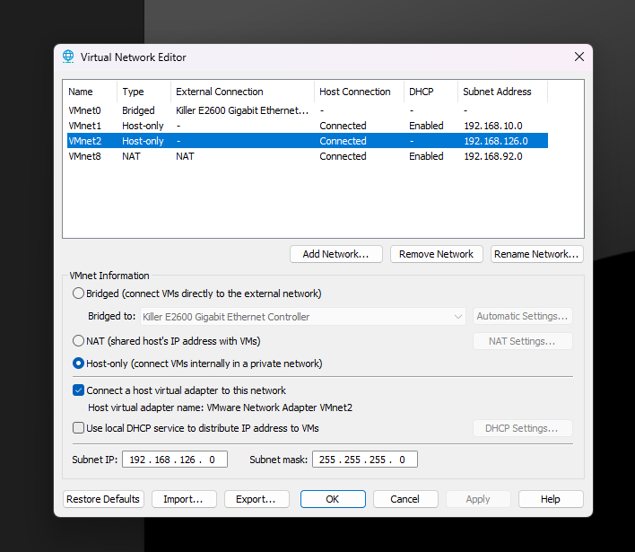
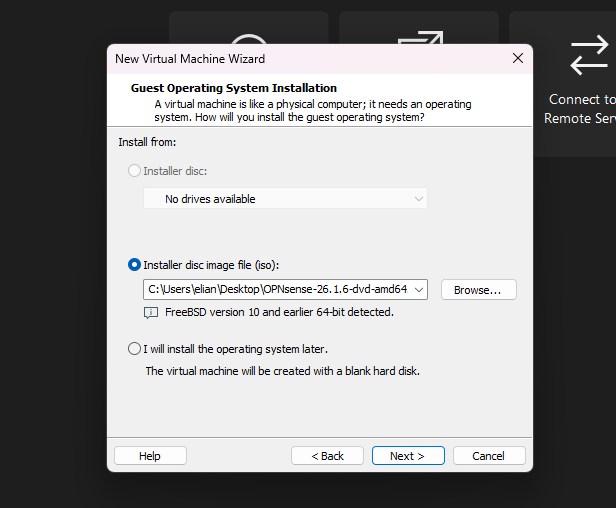
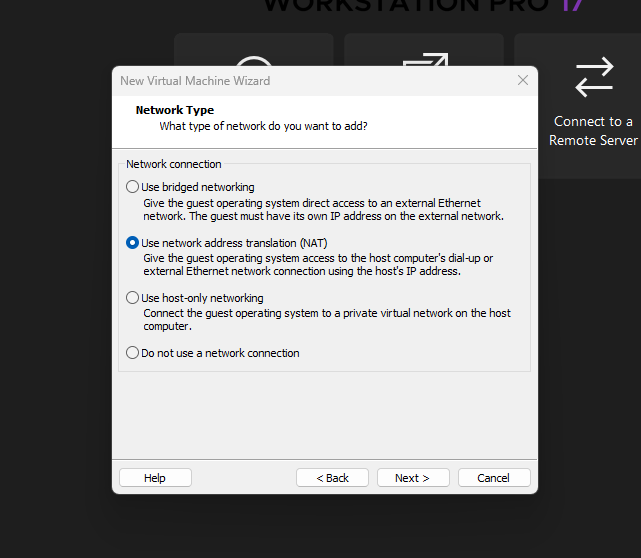
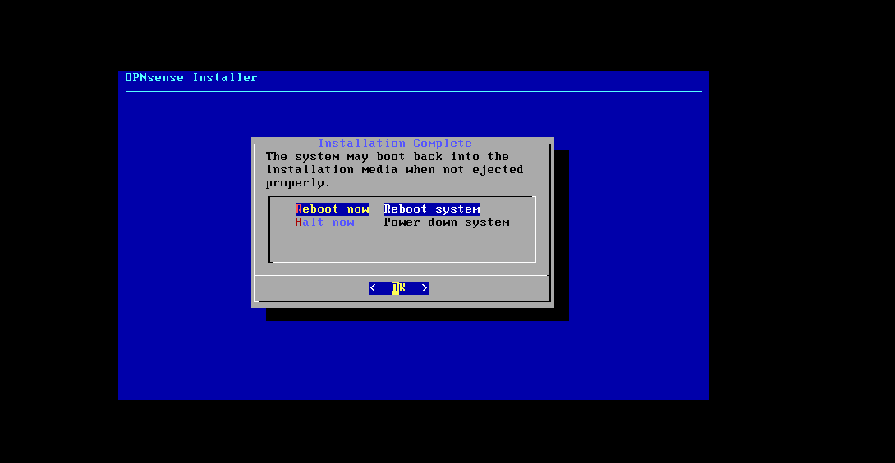
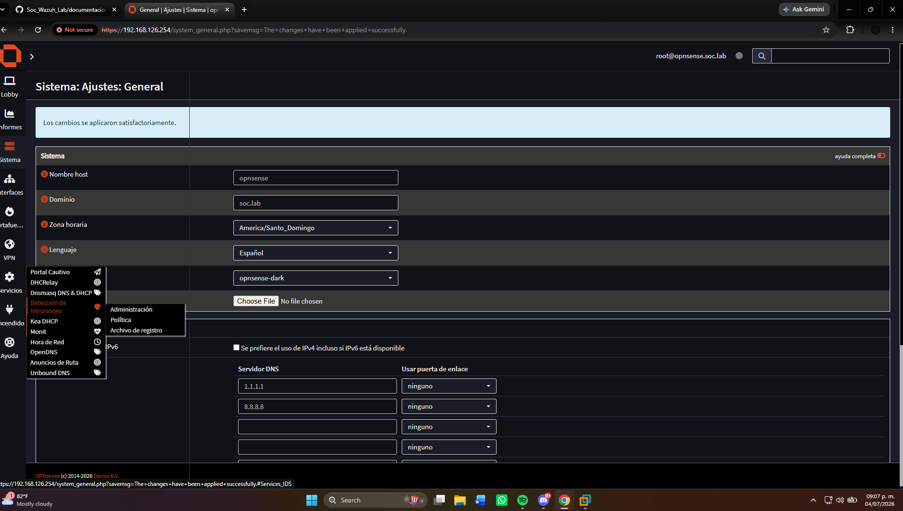

# Instalación y configuración de OPNsense

## Estado

> En progreso

## Objetivo

Instalar OPNsense como firewall principal del laboratorio SOC y utilizarlo como
puerta de enlace para las máquinas virtuales de la red interna.

Posteriormente se instalará Suricata para proporcionar funciones de IDS/IPS.

## Funciones de OPNsense

- Firewall del laboratorio.
- Enrutamiento entre la red WAN y la red LAN.
- Acceso a Internet para las máquinas virtuales.
- Servicio DHCP, si se decide utilizarlo.
- Implementación de Suricata como IDS/IPS.
- Monitoreo del tráfico de red.

## Requisitos de la máquina virtual

| Recurso | Configuración |
|---|---|
| Sistema | OPNsense |
| Procesadores | 2 |
| Memoria RAM | 4 GB |
| Disco | 20 GB |
| Adaptador 1 | NAT o Bridge — WAN |
| Adaptador 2 | Red interna — LAN |

## Interfaces de red

| Interfaz | Tipo de red | Función |
|---|---|---|
| WAN | NAT | Acceso a Internet |
| LAN | Red interna | Red protegida del laboratorio |

## Creación de la máquina virtual

1. Se creó una nueva máquina virtual.
2. Se seleccionó la imagen ISO de OPNsense.
3. Se asignaron 2 procesadores.
4. Se asignaron 4 GB de memoria RAM.
5. Se creó un disco virtual de 20 GB.
6. Se agregaron dos adaptadores de red.

## Configuración de los adaptadores

### Adaptador WAN

Configurado en modo NAT para proporcionar acceso a Internet.

### Adaptador LAN

Configurado en una red interna exclusiva para las máquinas virtuales del laboratorio.

Nombre de la red interna:

```text
SOC-LAN
```

## Instalación

La instalación será documentada paso por paso a medida que se configure la máquina virtual.

## Direccionamiento IP

| Interfaz | Dirección IP |
|---|---|
| WAN | DHCP |
| LAN | Pendiente |

## Evidencias

A continuación se muestran las evidencias recopiladas durante la creación e instalación de la máquina virtual OPNsense.

### Configuración de la red VMnet2

VMnet2 fue configurada como una red Host-only para funcionar como la red LAN interna del laboratorio. El servicio DHCP de VMware fue deshabilitado porque OPNsense administrará la asignación de direcciones IP.



### Compatibilidad de hardware

Se utilizó la compatibilidad de hardware de VMware Workstation 17.5 o posterior.


### Selección de la imagen ISO

Se seleccionó la imagen DVD ISO de OPNsense para iniciar la instalación.



### Configuración del procesador

La máquina virtual fue configurada con un procesador virtual y dos núcleos.


### Configuración del adaptador WAN

El primer adaptador utilizado para la conexión WAN fue configurado en modo NAT.



### Adaptadores de red

Se agregaron dos adaptadores de red a la máquina virtual.


### Configuración final de los adaptadores

El adaptador LAN fue conectado a VMnet2 y el adaptador WAN fue conectado a la red NAT de VMware.


### Arranque en modo Live

OPNsense inició desde la imagen ISO y detectó las interfaces LAN y WAN.


### Selección del teclado

Durante la instalación se mantuvo el mapa de teclado predeterminado.


### Instalación mediante ZFS

Se seleccionó ZFS como sistema de archivos para la instalación.


### Tipo de disco

Se seleccionó la configuración correspondiente a un solo disco virtual.


### Selección del disco virtual

El instalador detectó el disco virtual `da0`, creado exclusivamente para OPNsense.


### Progreso de la instalación

El instalador clonó el sistema y preparó el disco virtual de destino.


### Configuración de la contraseña

Al finalizar la instalación se configuró una contraseña para la cuenta `root`. La contraseña no fue almacenada en este repositorio.


### Reinicio del sistema

Después de completar la instalación se seleccionó la opción para reiniciar OPNsense.



### Desconexión de la imagen ISO

Se desconectó la unidad CD/DVD y se deshabilitó la opción `Connect at power on` para evitar que la máquina iniciara nuevamente desde el instalador.


### Primer inicio desde el disco

OPNsense inició correctamente desde el disco virtual y mostró las interfaces LAN y WAN en la consola.


## Configuración de la interfaz LAN

### 1. Menú principal de OPNsense


### 2. Selección de la interfaz LAN


### 3. Configuración de IPv4 en la LAN


### 4. Asignación de la dirección IP


### 5. Configuración de la máscara de red


### 6. Configuración de IPv6


## Configuración del servidor DHCP

### 7. Habilitación del servidor DHCP


### 8. Configuración del rango DHCP


## Acceso a la interfaz web

### 9. Configuración de HTTPS y certificado


### 10. Configuración LAN completada


### 11. Inicio de sesión web


### 12. Asistente de configuración inicial


## Configuración general

### 13. Acceso a los ajustes generales


### 14. Configuración de servidores DNS


### 15. Configuración general del sistema


### 16. Aplicación de los cambios


## Preparación del IDS/IPS

### 17. Acceso a detección de intrusiones



## Verificaciones

- [ ] OPNsense inicia correctamente.
- [ ] La interfaz WAN recibe una dirección IP.
- [ ] La interfaz LAN tiene una dirección IP estática.
- [ ] Los equipos de la red LAN pueden comunicarse con OPNsense.
- [ ] Los equipos de la red LAN tienen acceso a Internet.
- [ ] Es posible acceder al panel web de OPNsense.

## Problemas encontrados

En esta sección se documentarán los errores presentados durante la instalación.

## Soluciones aplicadas

En esta sección se registrarán las soluciones utilizadas.

## Resultado

Pendiente hasta completar la instalación y las pruebas.
