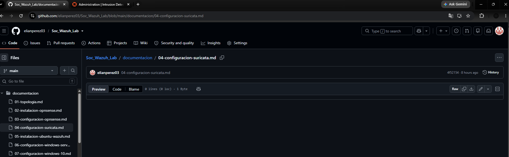
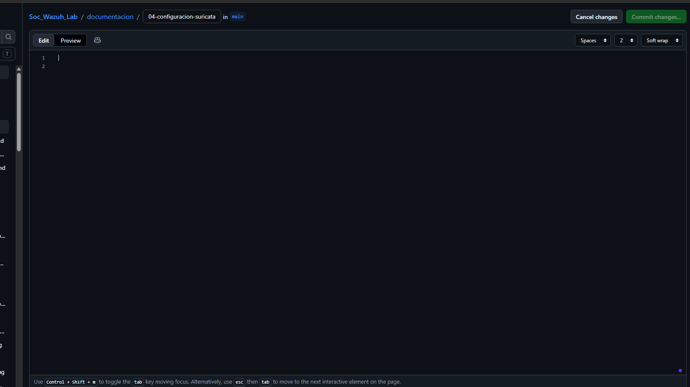
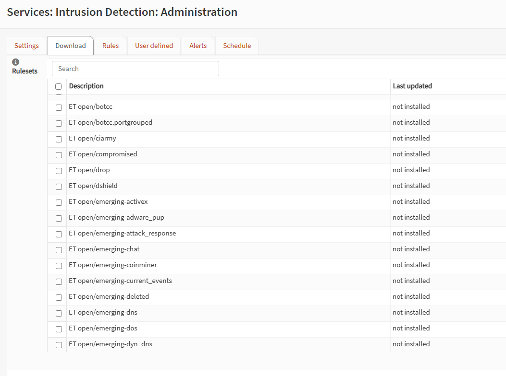
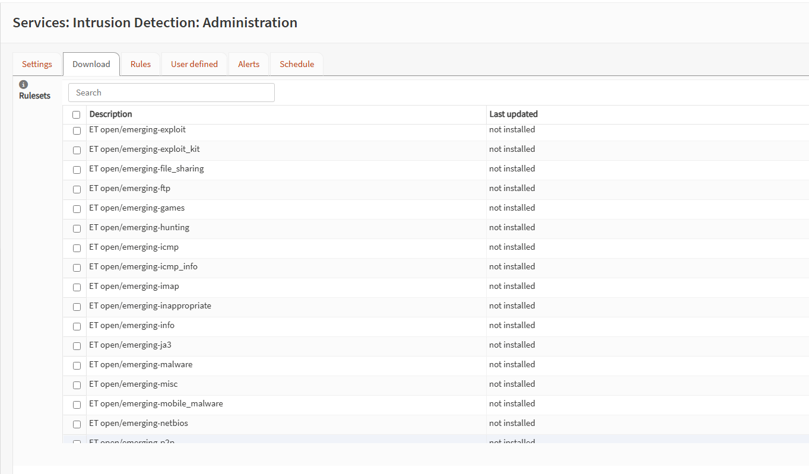
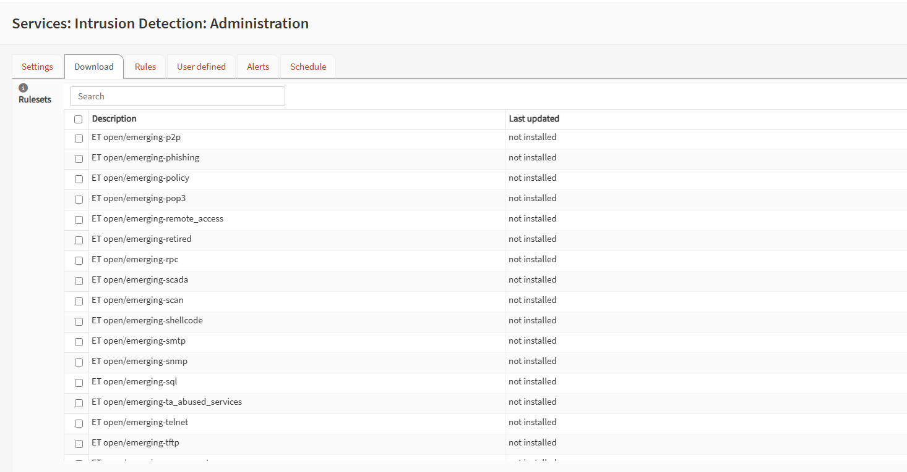
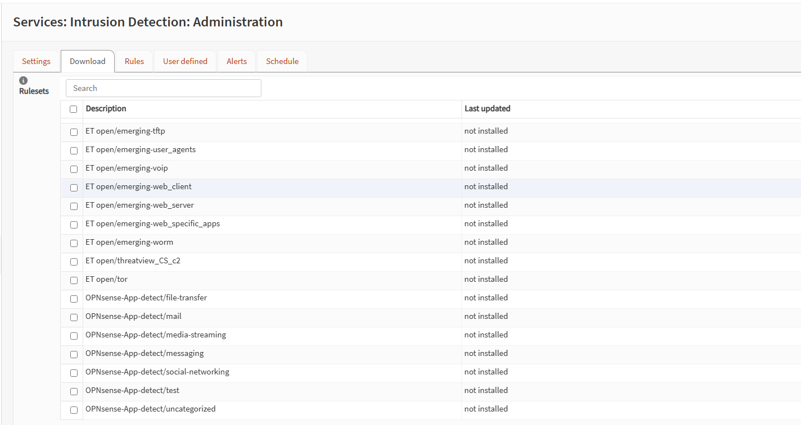
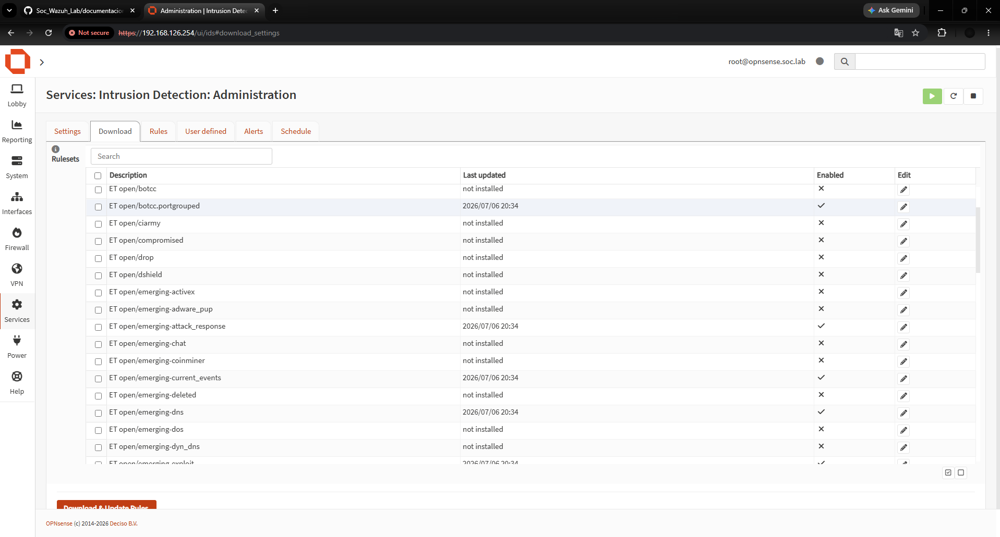
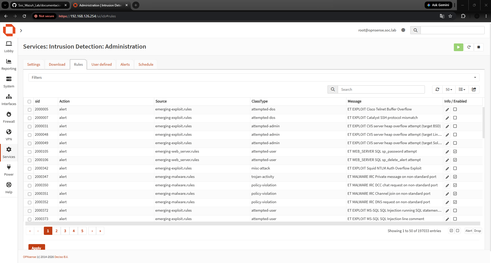

# Configuración de Suricata como IPS en OPNsense

## Estado

> Completado

## Objetivo

Configurar Suricata en OPNsense para inspeccionar el tráfico de la red LAN y funcionar como un sistema de prevención de intrusiones, o IPS.

Durante este proceso se realizaron las siguientes tareas:

- Activación de Suricata.
- Cambio del modo IDS al modo IPS.
- Selección de la interfaz LAN.
- Descarga de reglas de seguridad de `abuse.ch`.
- Creación de una política de bloqueo.
- Creación de una regla personalizada.
- Prueba del bloqueo desde Kali Linux.
- Verificación de las alertas generadas.
- Desactivación de la regla de prueba.

---

## 1. Configuración inicial de Suricata

Se accedió a la configuración de Suricata mediante la siguiente ruta:

```text
Services → Intrusion Detection → Administration → Settings
```

Inicialmente, Suricata se encontraba desactivado, configurado en modo `PCAP live mode (IDS)` y asociado a la interfaz WAN.

El modo IDS permite detectar y registrar actividad sospechosa, pero no bloquea el tráfico.


---

## 2. Configuración de Suricata en modo IPS

Se activó Suricata y se modificaron los siguientes parámetros:

| Parámetro | Configuración |
|---|---|
| Enabled | Activado |
| Capture mode | Netmap (IPS) |
| Interface | LAN |
| Promiscuous mode | Desactivado |
| Pattern matcher | Default |

El modo `Netmap (IPS)` permite que Suricata inspeccione el tráfico y descarte los paquetes que coincidan con reglas configuradas con la acción `Drop`.

Se seleccionó la interfaz LAN porque por ella circula el tráfico generado por las máquinas internas del laboratorio.


---

## 3. Verificación inicial de conectividad desde Kali Linux

Antes de aplicar las reglas de bloqueo, se verificó la conectividad de Kali Linux.

Se realizaron pruebas hacia:

- La puerta de enlace OPNsense: `192.168.126.254`.
- La dirección pública `1.1.1.1`.
- El dominio `google.com`.

También se utilizó el comando `ip a` para comprobar la dirección IP asignada a Kali Linux.

```bash
ping -c 4 192.168.126.254
ping -c 4 1.1.1.1
ping -c 4 google.com
ip a
```

La máquina Kali Linux tenía asignada la dirección IP:

```text
192.168.126.188
```

Las pruebas fueron exitosas y no se presentó pérdida de paquetes.


---

## 4. Revisión de los conjuntos de reglas disponibles

Se accedió a la pestaña **Download** para revisar los conjuntos de reglas disponibles para Suricata.

Inicialmente, las fuentes de reglas aparecían con el estado `not installed`, lo que indicaba que todavía no habían sido descargadas.


---

## 5. Selección de los conjuntos de reglas de abuse.ch

Se seleccionaron los siguientes conjuntos de reglas proporcionados por `abuse.ch`:

- Feodo Tracker.
- SSL Fingerprint Blacklist.
- SSL IP Blacklist.
- ThreatFox.
- URLhaus.

Estas fuentes contienen indicadores de compromiso relacionados con:

- Servidores de comando y control.
- Direcciones IP maliciosas.
- Certificados SSL sospechosos.
- Distribución de malware.
- Direcciones URL maliciosas.


---

## 6. Descarga y activación de las reglas

Después de seleccionar las fuentes, se presionó el botón:

```text
Download & Update Rules
```

Una vez finalizada la descarga, los conjuntos de reglas mostraron una fecha de actualización y una marca de verificación en la columna **Enabled**.

Esto confirmó que las reglas fueron instaladas y habilitadas correctamente.


---

## 7. Aplicación de la configuración del IPS

Se regresó a la pestaña **Settings** y se presionó el botón **Apply** para aplicar los cambios realizados.

En este punto, Suricata quedó habilitado en modo IPS sobre la interfaz LAN.


---

## 8. Acceso a las políticas de Suricata

Se accedió a la sección de políticas mediante la siguiente ruta:

```text
Services → Intrusion Detection → Policy
```

Inicialmente no existían políticas configuradas.

Las políticas permiten modificar de forma masiva el comportamiento de las reglas, por ejemplo, cambiar reglas cuya acción es `Alert` para que utilicen la acción `Drop`.


---

## 9. Creación de una nueva política

Se presionó el botón con el símbolo `+` para crear una nueva política de Suricata.

La política fue habilitada y se le asignó prioridad `1`.


---

## 10. Selección de los conjuntos de reglas para la política

Dentro de la nueva política se seleccionaron los conjuntos de reglas descargados desde `abuse.ch`.

De esta manera, la política solamente afectaría las reglas pertenecientes a estas fuentes.


---

## 11. Conversión de alertas en bloqueos

La política fue configurada con los siguientes parámetros:

| Parámetro | Valor |
|---|---|
| Enabled | Activado |
| Priority | 1 |
| Rulesets | Reglas de abuse.ch |
| Action | Alert |
| New action | Drop |
| Description | Bloquear indicadores maliciosos de abuse.ch |

Esta política cambia las reglas cuya acción original es `Alert` para que utilicen la acción `Drop`.

De esta forma, Suricata no solamente detecta el tráfico malicioso, sino que también lo bloquea.


---

## 12. Verificación de las reglas configuradas como Drop

Se accedió a la pestaña **Rules** para comprobar que las reglas de `abuse.ch` estuvieran habilitadas y configuradas con la acción `Drop`.

La presencia de la acción `Drop` confirmó que la política había sido aplicada correctamente.


---

## 13. Acceso a las reglas personalizadas

Se accedió a la pestaña **User defined** para crear una regla personalizada.

Inicialmente no existían reglas definidas por el usuario.


---

## 14. Creación de una regla personalizada de prueba

Se creó una regla personalizada para bloquear el tráfico desde Kali Linux hacia la dirección IP pública `1.1.1.1`.

La regla fue configurada de la siguiente manera:

| Parámetro | Valor |
|---|---|
| Enabled | Activado |
| Source IP | 192.168.126.188 |
| Destination IP | 1.1.1.1 |
| Action | Drop |
| Bypass | Desactivado |
| Description | Prueba IPS - bloquear Kali hacia 1.1.1.1 |

La dirección IP `192.168.126.188` corresponde a la máquina Kali Linux utilizada para realizar la prueba.


---

## 15. Regla personalizada guardada y habilitada

Después de guardar la configuración, la regla apareció en la lista de reglas personalizadas.

Se verificó que:

- La regla estuviera habilitada.
- La acción configurada fuera `Drop`.
- La descripción identificara correctamente la prueba.

Luego se presionó el botón **Apply** para aplicar la regla.


---

## 16. Verificación de los parámetros de la regla

Se abrió nuevamente la regla personalizada para comprobar que todos los parámetros estuvieran guardados correctamente.

Se confirmó lo siguiente:

- Dirección IP de origen: `192.168.126.188`.
- Dirección IP de destino: `1.1.1.1`.
- Acción: `Drop`.
- Regla habilitada.
- Opción `Bypass` desactivada.


---

## 17. Prueba de bloqueo desde Kali Linux

Desde Kali Linux se ejecutó nuevamente el siguiente comando:

```bash
ping -c 4 1.1.1.1
```

El resultado obtenido fue:

```text
4 packets transmitted, 0 received, 100% packet loss
```

La pérdida total de paquetes confirmó que Suricata estaba bloqueando correctamente el tráfico dirigido desde Kali Linux hacia `1.1.1.1`.


---

## 18. Verificación de las alertas generadas

Se accedió a la pestaña **Alerts** para revisar los eventos generados por la regla personalizada.

Los registros mostraron la siguiente información:

| Campo | Valor |
|---|---|
| Action | blocked |
| Interface | LAN |
| Source | 192.168.126.188 |
| Destination | 1.1.1.1 |
| Alert | Prueba IPS - bloquear Kali hacia 1.1.1.1 |

Esto confirmó que Suricata detectó y bloqueó los paquetes enviados durante la prueba.


---

## 19. Desactivación de la regla de prueba

Después de confirmar el funcionamiento del IPS, se desactivó la regla personalizada para restaurar la conectividad hacia `1.1.1.1`.

Se desmarcó la casilla **Enabled** y se presionó el botón **Apply**.


---

## 20. Verificación de conectividad después de desactivar la regla

Desde Kali Linux se ejecutó nuevamente el siguiente comando:

```bash
ping -c 4 1.1.1.1
```

Durante la aplicación de los cambios se presentó una pérdida parcial de paquetes. Posteriormente, las respuestas comenzaron a recibirse nuevamente.

Esto confirmó que la conectividad hacia `1.1.1.1` fue restaurada después de desactivar la regla personalizada.


---
# Configuración de reglas ET Open

Después de comprobar el funcionamiento de Suricata como IPS mediante una regla personalizada, se continuó la configuración habilitando conjuntos de reglas de **Emerging Threats Open**, identificadas en OPNsense como `ET open`.

Estas reglas amplían la capacidad de detección de Suricata frente a ataques, malware, phishing, escaneos de red, explotación de vulnerabilidades y amenazas dirigidas a aplicaciones web.

---

## 21. Archivo de configuración de Suricata en GitHub

Se verificó la existencia del archivo:

```text
documentacion/04-configuracion-suricata.md
```

Este archivo se utiliza para documentar todo el proceso de configuración de Suricata como IDS/IPS dentro del laboratorio SOC.



---

## 22. Edición del archivo de documentación

Se abrió el archivo `04-configuracion-suricata.md` en el editor de GitHub para agregar la documentación correspondiente a la instalación, configuración y pruebas realizadas con Suricata.



---

## 23. Revisión inicial de las reglas ET Open

Se accedió a la siguiente ruta:

```text
Services → Intrusion Detection → Administration → Download
```

En esta sección se encuentran los diferentes conjuntos de reglas disponibles para Suricata.

Inicialmente, las reglas de `ET open` aparecían con el estado:

```text
not installed
```

Esto indicaba que todavía no habían sido descargadas ni activadas en el sistema.



---

## 24. Revisión de categorías de ataques y malware

Se continuó revisando el listado de reglas disponibles.

Entre las categorías mostradas se encontraban reglas relacionadas con:

- Explotación de vulnerabilidades.
- Kits de explotación.
- Transferencia de archivos.
- Protocolos FTP.
- Actividades de búsqueda de amenazas.
- Tráfico ICMP.
- Malware.
- Aplicaciones y servicios de red.



---

## 25. Revisión de reglas de phishing, escaneo y acceso remoto

En la siguiente parte del listado se observaron categorías relacionadas con:

- Redes P2P.
- Phishing.
- Políticas de seguridad.
- Acceso remoto.
- Escaneo de puertos y servicios.
- Shellcode.
- SMTP.
- SNMP.
- Ataques SQL.
- Telnet.
- TFTP.



---

## 26. Revisión de reglas para aplicaciones web

En la parte final del listado se observaron reglas relacionadas con:

- Agentes de usuario sospechosos.
- Telefonía VoIP.
- Ataques contra clientes web.
- Ataques contra servidores web.
- Vulnerabilidades específicas de aplicaciones web.
- Gusanos informáticos.
- Tráfico de redes Tor.
- Detección de aplicaciones.



---

## 27. Selección y descarga de reglas ET Open

Para ampliar la cobertura de detección de Suricata, se seleccionaron y habilitaron los siguientes conjuntos de reglas:

| Conjunto de reglas | Función principal |
|---|---|
| `ET open/botcc.portgrouped` | Detecta comunicaciones relacionadas con botnets y servidores de comando y control |
| `ET open/emerging-attack_response` | Detecta respuestas asociadas con ataques o sistemas comprometidos |
| `ET open/emerging-current_events` | Contiene reglas relacionadas con amenazas y campañas recientes |
| `ET open/emerging-dns` | Detecta actividad DNS sospechosa o maliciosa |
| `ET open/emerging-exploit` | Detecta intentos de explotación de vulnerabilidades |
| `ET open/emerging-malware` | Detecta tráfico relacionado con malware |
| `ET open/emerging-phishing` | Detecta dominios, enlaces y actividad relacionada con phishing |
| `ET open/emerging-scan` | Detecta escaneos de red, puertos y servicios |
| `ET open/emerging-shellcode` | Detecta patrones asociados con shellcode |
| `ET open/emerging-web_client` | Detecta ataques dirigidos a navegadores y clientes web |
| `ET open/emerging-web_server` | Detecta ataques dirigidos a servidores web |
| `ET open/emerging-web_specific_apps` | Detecta ataques contra aplicaciones web específicas |

Después de seleccionar estas categorías, se utilizó la opción:

```text
Download & Update Rules
```

Una vez finalizada la descarga, las categorías habilitadas mostraron una fecha en la columna **Last updated** y una marca de verificación en la columna **Enabled**.



---

## 28. Verificación de las reglas ET Open instaladas

Se accedió a la pestaña:

```text
Services → Intrusion Detection → Administration → Rules
```

En esta sección se comprobó que las firmas pertenecientes a las categorías de `ET open` habían sido cargadas correctamente.

La tabla muestra información como:

| Campo | Descripción |
|---|---|
| SID | Identificador único de la regla |
| Action | Acción original de la regla |
| Source | Archivo o conjunto de reglas al que pertenece |
| ClassType | Clasificación de la amenaza |
| Message | Descripción de la actividad detectada |
| Enabled | Indica si la firma está activa |

En la captura se observan reglas relacionadas con:

- Desbordamientos de búfer.
- Ataques contra protocolos SSH y Telnet.
- Intentos de acceso administrativo.
- Inyección SQL.
- Explotación de servidores web.
- Actividad de malware.
- Comunicaciones IRC sospechosas.

Las reglas aparecen inicialmente con la acción `alert`. Esta acción permite detectar y registrar el tráfico que coincida con una firma.

Cuando una política cambia la acción de `Alert` a `Drop`, las reglas seleccionadas también pueden bloquear el tráfico en modo IPS.



---

## Resultado final

Suricata quedó configurado correctamente como sistema de prevención de intrusiones, o IPS, dentro de OPNsense.

El sistema quedó preparado para:

- Inspeccionar el tráfico que atraviesa la interfaz LAN.
- Detectar tráfico relacionado con indicadores de compromiso.
- Utilizar reglas externas proporcionadas por `abuse.ch`.
- Utilizar reglas de Emerging Threats Open, o `ET open`.
- Detectar actividad relacionada con botnets y servidores de comando y control.
- Detectar intentos de explotación de vulnerabilidades.
- Identificar tráfico relacionado con malware y phishing.
- Detectar escaneos de red, shellcode y actividad DNS sospechosa.
- Detectar ataques dirigidos a clientes, servidores y aplicaciones web.
- Convertir reglas con acción `Alert` en acciones de bloqueo mediante políticas.
- Crear reglas personalizadas utilizando direcciones IP de origen y destino.
- Bloquear tráfico en tiempo real mediante la acción `Drop`.
- Registrar los eventos bloqueados en la sección de alertas.
- Restaurar la conectividad al desactivar una regla personalizada.

La prueba realizada desde Kali Linux confirmó que Suricata fue capaz de bloquear el tráfico dirigido hacia `1.1.1.1` y registrar correctamente los eventos generados.

Además, la instalación de las reglas de `abuse.ch` y `ET open` amplió la capacidad de detección frente a diferentes tipos de amenazas, como malware, phishing, explotación de vulnerabilidades, escaneos de red y ataques contra aplicaciones web.

Con esta configuración, OPNsense y Suricata proporcionan una capa adicional de detección y prevención para proteger las máquinas virtuales que forman parte del laboratorio SOC.

> **Nota:** Antes de convertir grandes cantidades de reglas de `Alert` a `Drop`, es recomendable supervisar las alertas generadas para identificar posibles falsos positivos y evitar el bloqueo de tráfico legítimo.
