# Configuración de Suricata como IPS en OPNsense

## Estado

> Completado

## Objetivo

Configurar Suricata en OPNsense para inspeccionar el tráfico de la red LAN y funcionar como un sistema de prevención de intrusiones, o IPS.

Durante este proceso se realizaron las siguientes tareas:

- Activación de Suricata.
- Cambio del modo IDS al modo IPS.
- Selección de la interfaz LAN.
- Descarga de reglas de seguridad de `abuse.ch`.
- Creación de una política de bloqueo.
- Creación de una regla personalizada.
- Prueba del bloqueo desde Kali Linux.
- Verificación de las alertas generadas.
- Desactivación de la regla de prueba.

---

## 1. Configuración inicial de Suricata

Se accedió a la configuración de Suricata mediante la siguiente ruta:

```text
Services → Intrusion Detection → Administration → Settings
```

Inicialmente, Suricata se encontraba desactivado, configurado en modo `PCAP live mode (IDS)` y asociado a la interfaz WAN.

El modo IDS permite detectar y registrar actividad sospechosa, pero no bloquea el tráfico.

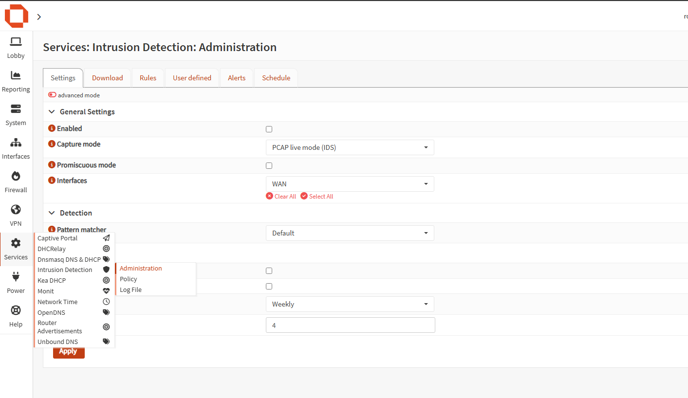

---

## 2. Configuración de Suricata en modo IPS

Se activó Suricata y se modificaron los siguientes parámetros:

| Parámetro | Configuración |
|---|---|
| Enabled | Activado |
| Capture mode | Netmap (IPS) |
| Interface | LAN |
| Promiscuous mode | Desactivado |
| Pattern matcher | Default |

El modo `Netmap (IPS)` permite que Suricata inspeccione el tráfico y descarte los paquetes que coincidan con reglas configuradas con la acción `Drop`.

Se seleccionó la interfaz LAN porque por ella circula el tráfico generado por las máquinas internas del laboratorio.

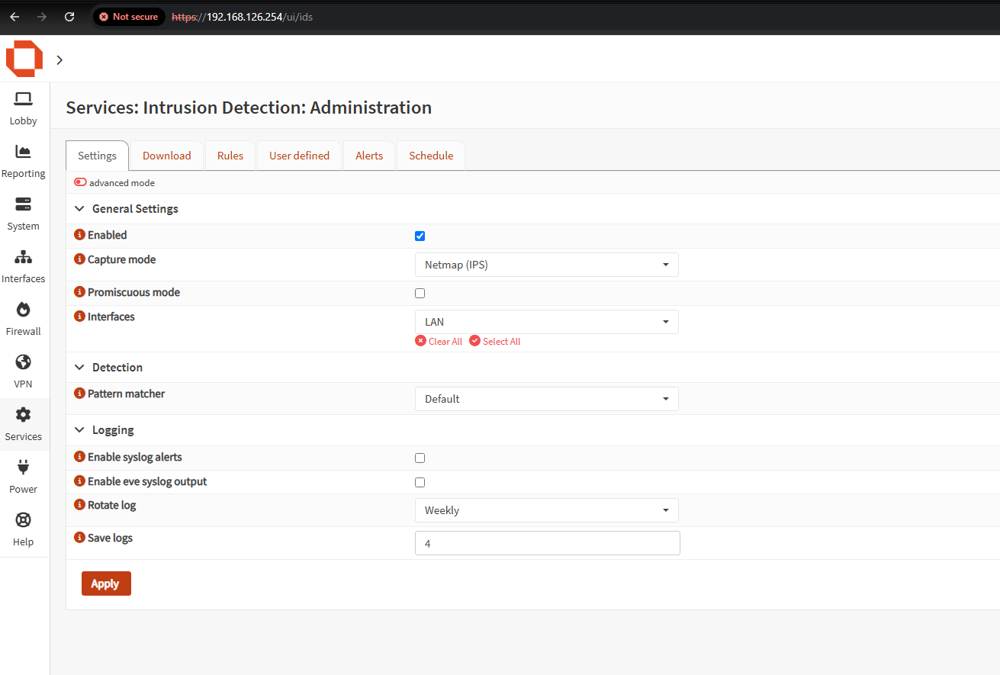

---

## 3. Verificación inicial de conectividad desde Kali Linux

Antes de aplicar las reglas de bloqueo, se verificó la conectividad de Kali Linux.

Se realizaron pruebas hacia:

- La puerta de enlace OPNsense: `192.168.126.254`.
- La dirección pública `1.1.1.1`.
- El dominio `google.com`.

También se utilizó el comando `ip a` para comprobar la dirección IP asignada a Kali Linux.

```bash
ping -c 4 192.168.126.254
ping -c 4 1.1.1.1
ping -c 4 google.com
ip a
```

La máquina Kali Linux tenía asignada la dirección IP:

```text
192.168.126.188
```

Las pruebas fueron exitosas y no se presentó pérdida de paquetes.

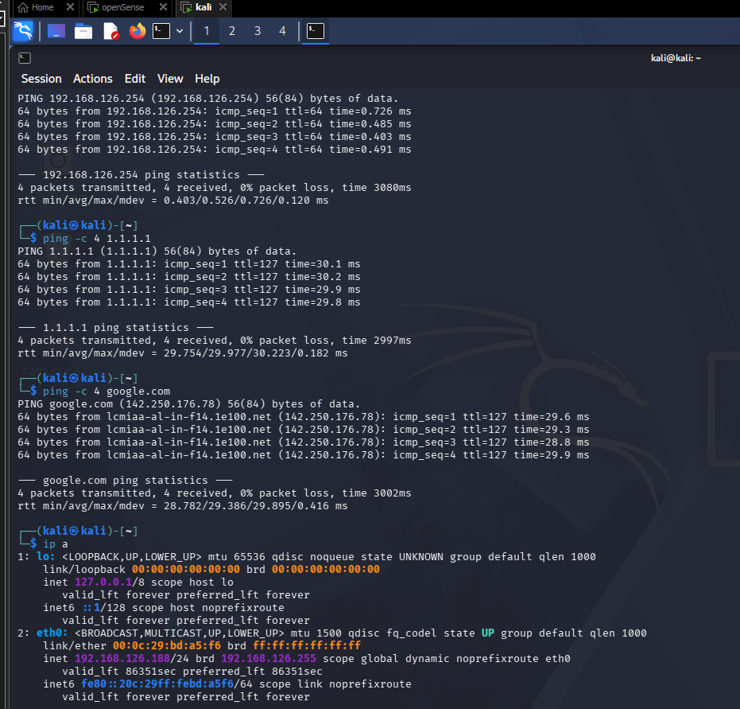

---

## 4. Revisión de los conjuntos de reglas disponibles

Se accedió a la pestaña **Download** para revisar los conjuntos de reglas disponibles para Suricata.

Inicialmente, las fuentes de reglas aparecían con el estado `not installed`, lo que indicaba que todavía no habían sido descargadas.

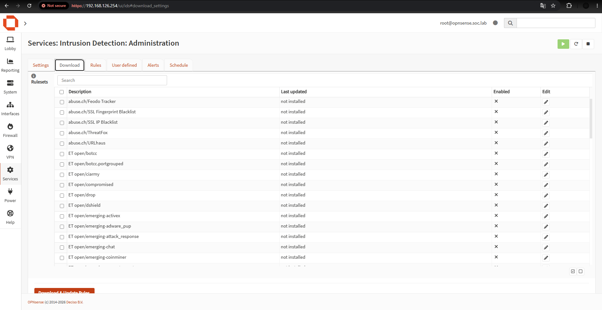

---

## 5. Selección de los conjuntos de reglas de abuse.ch

Se seleccionaron los siguientes conjuntos de reglas proporcionados por `abuse.ch`:

- Feodo Tracker.
- SSL Fingerprint Blacklist.
- SSL IP Blacklist.
- ThreatFox.
- URLhaus.

Estas fuentes contienen indicadores de compromiso relacionados con:

- Servidores de comando y control.
- Direcciones IP maliciosas.
- Certificados SSL sospechosos.
- Distribución de malware.
- Direcciones URL maliciosas.

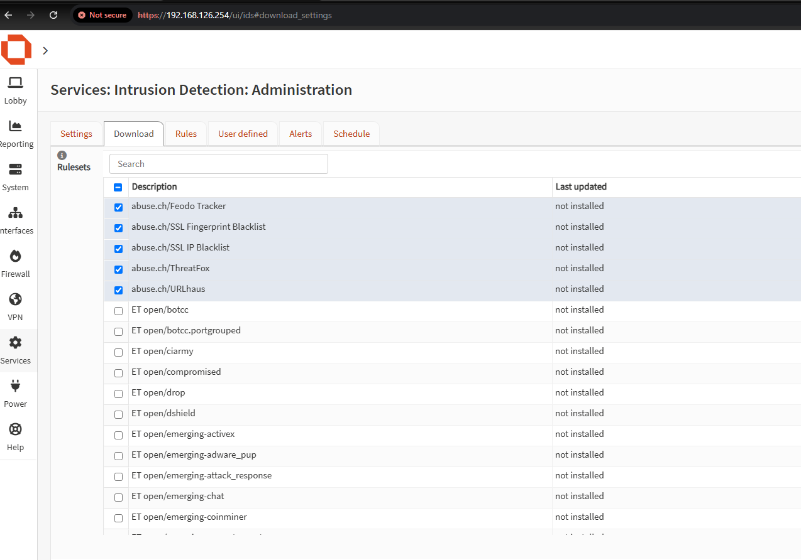

---

## 6. Descarga y activación de las reglas

Después de seleccionar las fuentes, se presionó el botón:

```text
Download & Update Rules
```

Una vez finalizada la descarga, los conjuntos de reglas mostraron una fecha de actualización y una marca de verificación en la columna **Enabled**.

Esto confirmó que las reglas fueron instaladas y habilitadas correctamente.

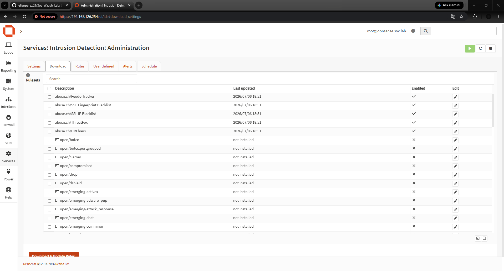

---

## 7. Aplicación de la configuración del IPS

Se regresó a la pestaña **Settings** y se presionó el botón **Apply** para aplicar los cambios realizados.

En este punto, Suricata quedó habilitado en modo IPS sobre la interfaz LAN.

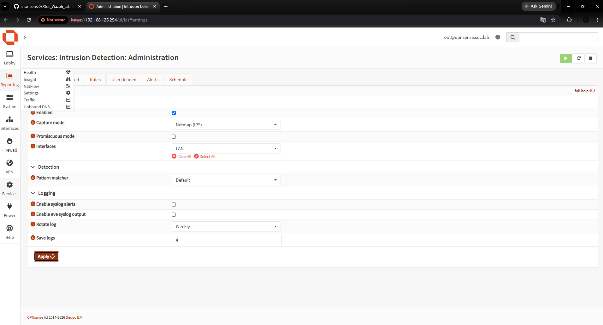

---

## 8. Acceso a las políticas de Suricata

Se accedió a la sección de políticas mediante la siguiente ruta:

```text
Services → Intrusion Detection → Policy
```

Inicialmente no existían políticas configuradas.

Las políticas permiten modificar de forma masiva el comportamiento de las reglas, por ejemplo, cambiar reglas cuya acción es `Alert` para que utilicen la acción `Drop`.

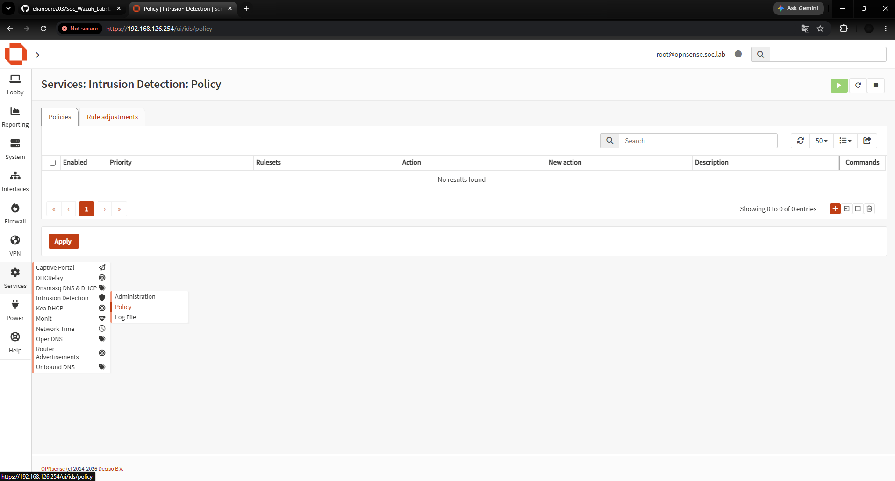

---

## 9. Creación de una nueva política

Se presionó el botón con el símbolo `+` para crear una nueva política de Suricata.

La política fue habilitada y se le asignó prioridad `1`.

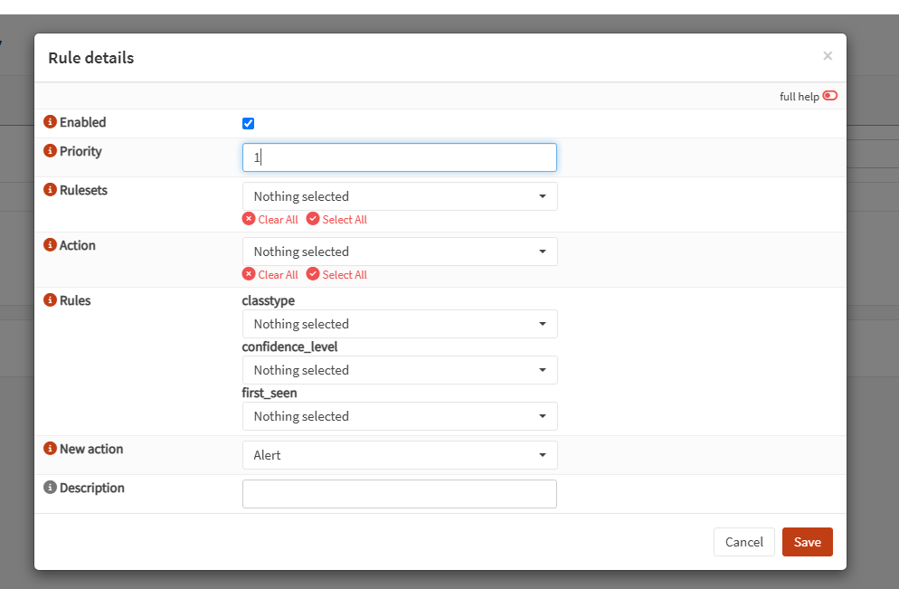

---

## 10. Selección de los conjuntos de reglas para la política

Dentro de la nueva política se seleccionaron los conjuntos de reglas descargados desde `abuse.ch`.

De esta manera, la política solamente afectaría las reglas pertenecientes a estas fuentes.

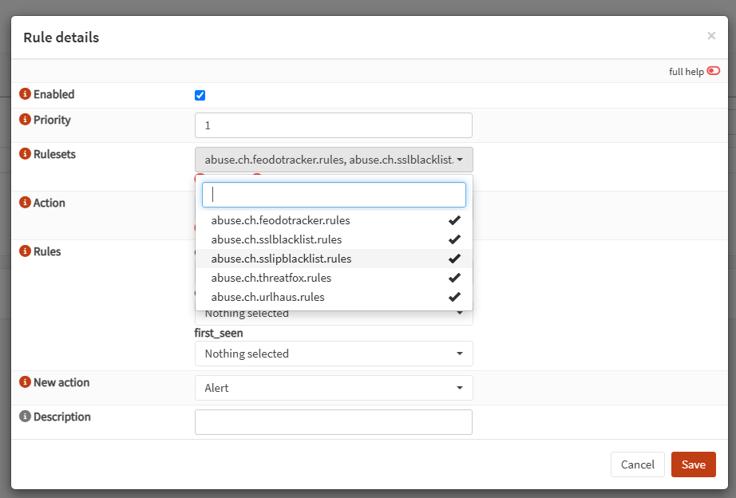

---

## 11. Conversión de alertas en bloqueos

La política fue configurada con los siguientes parámetros:

| Parámetro | Valor |
|---|---|
| Enabled | Activado |
| Priority | 1 |
| Rulesets | Reglas de abuse.ch |
| Action | Alert |
| New action | Drop |
| Description | Bloquear indicadores maliciosos de abuse.ch |

Esta política cambia las reglas cuya acción original es `Alert` para que utilicen la acción `Drop`.

De esta forma, Suricata no solamente detecta el tráfico malicioso, sino que también lo bloquea.

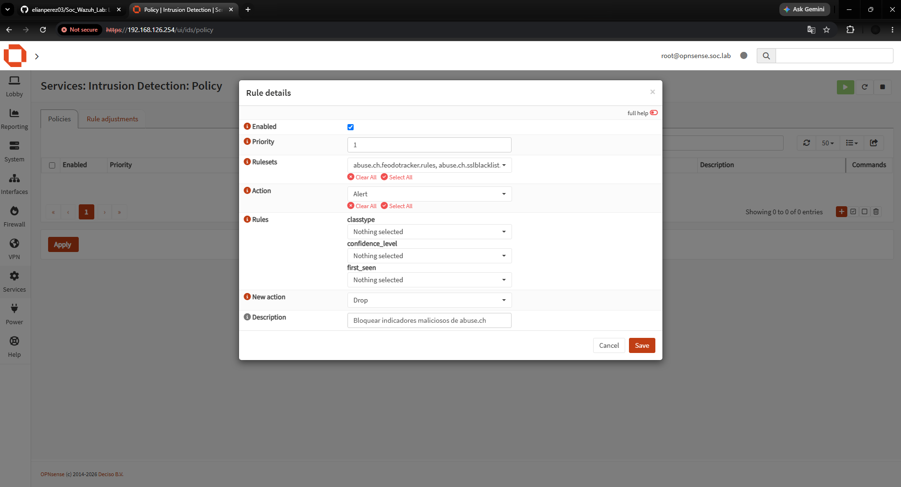

---

## 12. Verificación de las reglas configuradas como Drop

Se accedió a la pestaña **Rules** para comprobar que las reglas de `abuse.ch` estuvieran habilitadas y configuradas con la acción `Drop`.

La presencia de la acción `Drop` confirmó que la política había sido aplicada correctamente.

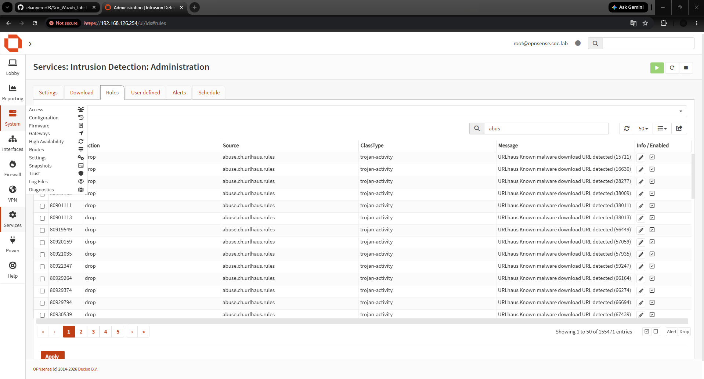

---

## 13. Acceso a las reglas personalizadas

Se accedió a la pestaña **User defined** para crear una regla personalizada.

Inicialmente no existían reglas definidas por el usuario.

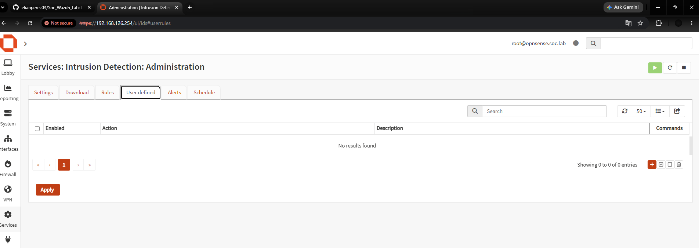

---

## 14. Creación de una regla personalizada de prueba

Se creó una regla personalizada para bloquear el tráfico desde Kali Linux hacia la dirección IP pública `1.1.1.1`.

La regla fue configurada de la siguiente manera:

| Parámetro | Valor |
|---|---|
| Enabled | Activado |
| Source IP | 192.168.126.188 |
| Destination IP | 1.1.1.1 |
| Action | Drop |
| Bypass | Desactivado |
| Description | Prueba IPS - bloquear Kali hacia 1.1.1.1 |

La dirección IP `192.168.126.188` corresponde a la máquina Kali Linux utilizada para realizar la prueba.

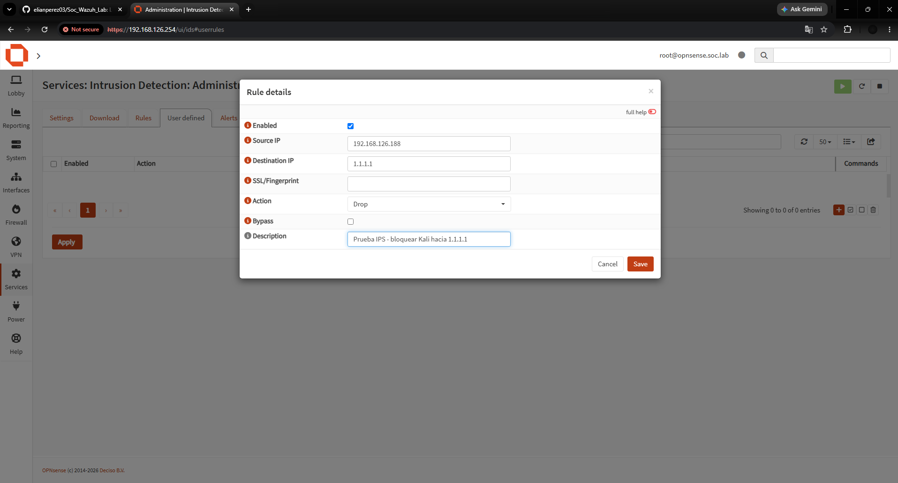

---

## 15. Regla personalizada guardada y habilitada

Después de guardar la configuración, la regla apareció en la lista de reglas personalizadas.

Se verificó que:

- La regla estuviera habilitada.
- La acción configurada fuera `Drop`.
- La descripción identificara correctamente la prueba.

Luego se presionó el botón **Apply** para aplicar la regla.

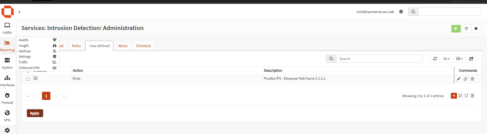

---

## 16. Verificación de los parámetros de la regla

Se abrió nuevamente la regla personalizada para comprobar que todos los parámetros estuvieran guardados correctamente.

Se confirmó lo siguiente:

- Dirección IP de origen: `192.168.126.188`.
- Dirección IP de destino: `1.1.1.1`.
- Acción: `Drop`.
- Regla habilitada.
- Opción `Bypass` desactivada.

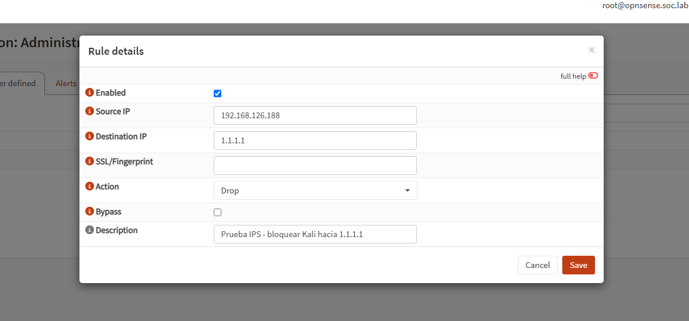

---

## 17. Prueba de bloqueo desde Kali Linux

Desde Kali Linux se ejecutó nuevamente el siguiente comando:

```bash
ping -c 4 1.1.1.1
```

El resultado obtenido fue:

```text
4 packets transmitted, 0 received, 100% packet loss
```

La pérdida total de paquetes confirmó que Suricata estaba bloqueando correctamente el tráfico dirigido desde Kali Linux hacia `1.1.1.1`.

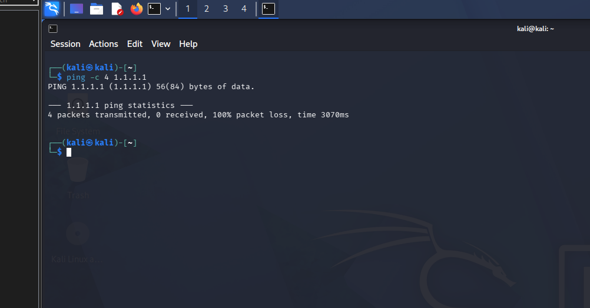

---

## 18. Verificación de las alertas generadas

Se accedió a la pestaña **Alerts** para revisar los eventos generados por la regla personalizada.

Los registros mostraron la siguiente información:

| Campo | Valor |
|---|---|
| Action | blocked |
| Interface | LAN |
| Source | 192.168.126.188 |
| Destination | 1.1.1.1 |
| Alert | Prueba IPS - bloquear Kali hacia 1.1.1.1 |

Esto confirmó que Suricata detectó y bloqueó los paquetes enviados durante la prueba.

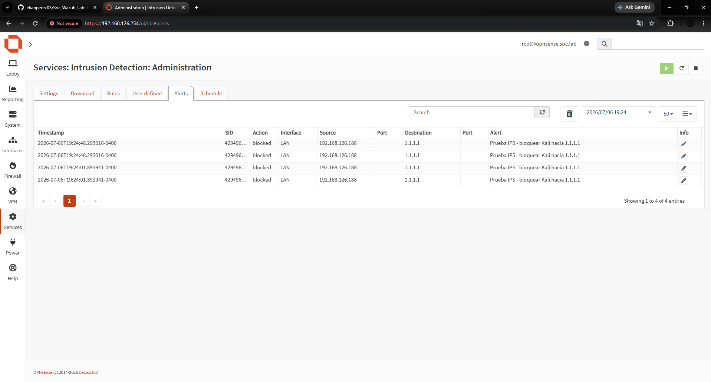

---

## 19. Desactivación de la regla de prueba

Después de confirmar el funcionamiento del IPS, se desactivó la regla personalizada para restaurar la conectividad hacia `1.1.1.1`.

Se desmarcó la casilla **Enabled** y se presionó el botón **Apply**.

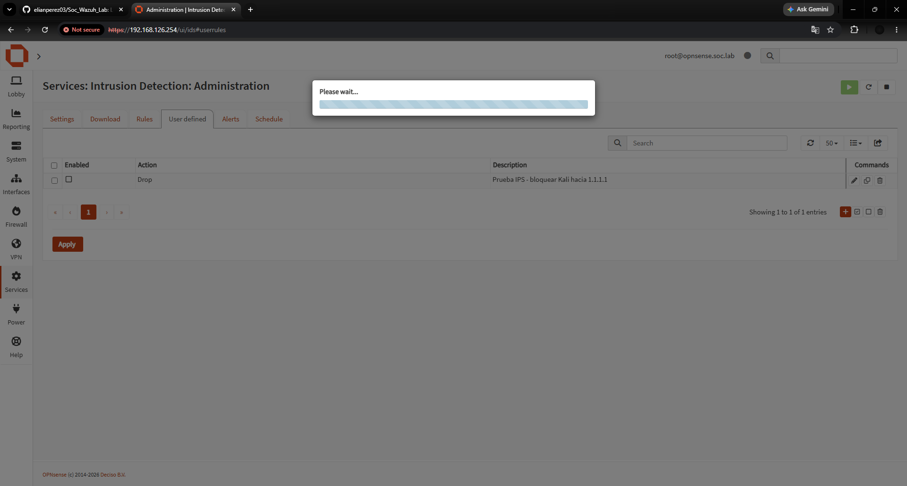

---

## 20. Verificación de conectividad después de desactivar la regla

Desde Kali Linux se ejecutó nuevamente el siguiente comando:

```bash
ping -c 4 1.1.1.1
```

Durante la aplicación de los cambios se presentó una pérdida parcial de paquetes. Posteriormente, las respuestas comenzaron a recibirse nuevamente.

Esto confirmó que la conectividad hacia `1.1.1.1` fue restaurada después de desactivar la regla personalizada.

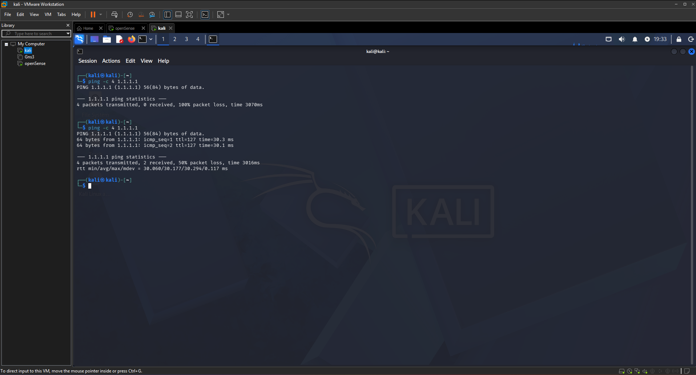

---

## Resultado final

Suricata quedó configurado correctamente como IPS en OPNsense.

El sistema quedó preparado para:

- Inspeccionar el tráfico de la interfaz LAN.
- Detectar tráfico relacionado con indicadores de compromiso.
- Utilizar reglas externas proporcionadas por `abuse.ch`.
- Convertir alertas en acciones de bloqueo.
- Crear reglas personalizadas por dirección IP.
- Bloquear tráfico en tiempo real.
- Registrar los paquetes bloqueados en la sección de alertas.
- Restaurar la conectividad al desactivar una regla.

La prueba realizada desde Kali Linux confirmó que OPNsense y Suricata están funcionando correctamente como sistema de prevención de intrusiones dentro del laboratorio SOC.

> **Nota:** La regla utilizada para bloquear el acceso a `1.1.1.1` fue creada únicamente para comprobar el funcionamiento del IPS. Después de finalizar la prueba, la regla fue desactivada para evitar interrupciones en la conectividad.
