# Configuración de Windows Server 2022, Active Directory, DNS y DHCP

## Estado

> Completado

## Objetivo

Instalar y configurar Windows Server 2022 como controlador de dominio principal
del laboratorio SOC.

Este servidor será responsable de:

- Administrar el dominio interno `soc.lab`.
- Centralizar la administración de usuarios, grupos, equipos y servidores.
- Proporcionar autenticación mediante Active Directory.
- Resolver nombres internos mediante DNS.
- Permitir que Windows 10 se una al dominio.
- Servir como endpoint monitoreado por Wazuh.
- Integrarse con OPNsense, Suricata y el resto del laboratorio.

---

## Arquitectura utilizada

```text
Internet
   │
   ▼
OPNsense
WAN: NAT
LAN: 192.168.126.254
   │
   ▼
VMnet2 - 192.168.126.0/24
   │
   ├── Wazuh Server: 192.168.126.10
   ├── Windows Server: 192.168.126.20
   ├── Windows 10: DHCP
   └── Kali Linux: DHCP
```

---

## Configuración final del servidor

| Parámetro | Valor |
|---|---|
| Sistema operativo | Windows Server 2022 Standard Evaluation |
| Nombre del servidor | `SRV-DC01` |
| Dominio | `soc.lab` |
| Nombre NetBIOS | `SOC` |
| Dirección IP | `192.168.126.20` |
| Máscara | `255.255.255.0` |
| Puerta de enlace | `192.168.126.254` |
| Servidor DNS | `192.168.126.20` |
| Red VMware | `VMnet2` |
| Rol principal | Controlador de dominio |
| Roles instalados | AD DS y DNS |
| Nivel funcional del dominio | Windows Server 2016 |
| Nivel funcional del bosque | Windows Server 2016 |

---

# 1. Cambio del nombre del servidor

Después de instalar Windows Server 2022, el sistema tenía un nombre generado
automáticamente.

Para identificar correctamente su función dentro del laboratorio, se cambió el
nombre del equipo a:

```text
SRV-DC01
```

La nomenclatura utilizada significa:

- `SRV`: servidor.
- `DC`: Domain Controller.
- `01`: primer controlador de dominio del laboratorio.

El cambio se realizó desde:

```text
Administrador del servidor
→ Servidor local
→ Nombre del equipo
→ Cambiar
```

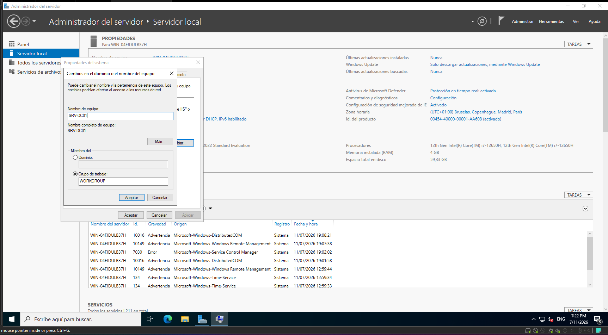

Después de aplicar el nuevo nombre, el servidor fue reiniciado.

---

# 2. Configuración de la dirección IP estática

El servidor recibió inicialmente una dirección IP mediante DHCP:

```text
192.168.126.189
```

Debido a que el servidor funcionará como controlador de dominio y servidor DNS,
no debe depender de una dirección dinámica.

Se configuró la siguiente dirección IP estática:

```text
Dirección IP: 192.168.126.20
Máscara: 255.255.255.0
Puerta de enlace: 192.168.126.254
DNS temporal: 192.168.126.254
```

La dirección `192.168.126.20` está fuera del rango DHCP:

```text
192.168.126.100-192.168.126.200
```

Esto evita conflictos de direcciones IP.

La configuración se realizó desde:

```text
Panel de control
→ Redes e Internet
→ Centro de redes y recursos compartidos
→ Cambiar configuración del adaptador
→ Ethernet0
→ Propiedades
→ Protocolo de Internet versión 4
```

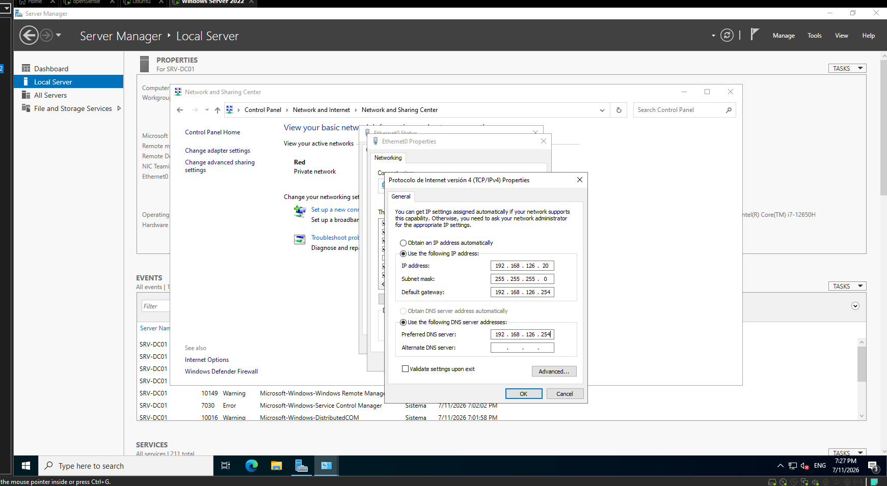

En esta etapa se utilizó temporalmente OPNsense como servidor DNS, ya que el
servicio DNS de Windows Server todavía no estaba instalado.

---

# 3. Verificación de la configuración de red

Después de configurar la dirección IP estática se abrió PowerShell como
administrador.

Se ejecutó:

```powershell
ipconfig /all
```

La salida confirmó:

```text
Nombre del equipo: SRV-DC01
Dirección IPv4: 192.168.126.20
Máscara: 255.255.255.0
Gateway: 192.168.126.254
DHCP habilitado: No
DNS: 192.168.126.254
```

También se realizaron pruebas de conectividad.

## Ping hacia OPNsense

```powershell
ping 192.168.126.254
```

## Ping hacia Wazuh

```powershell
ping 192.168.126.10
```

## Ping hacia Internet

```powershell
ping 8.8.8.8
```

## Prueba de resolución DNS

```powershell
nslookup google.com
```

Todas las pruebas respondieron correctamente.

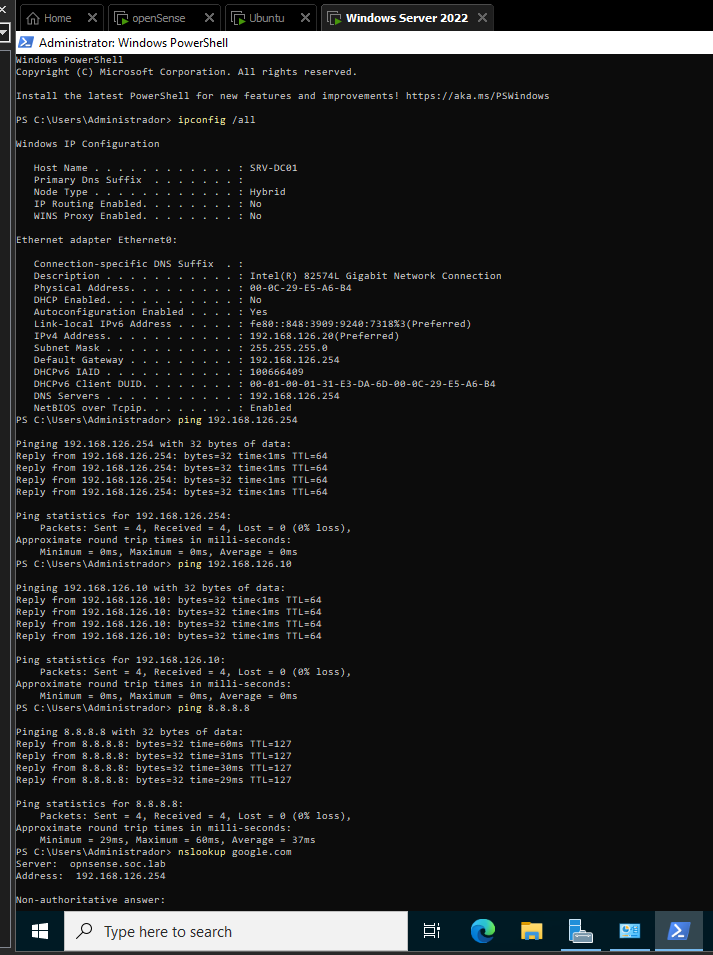

Esto confirmó que Windows Server podía comunicarse con:

- OPNsense.
- El servidor Wazuh.
- Internet.
- El servicio DNS.

---

# 4. Instalación de Active Directory Domain Services

Desde el Administrador del servidor se abrió:

```text
Administrar
→ Agregar roles y características
```

Se seleccionó:

```text
Instalación basada en características o en roles
```

Como servidor de destino se eligió:

```text
SRV-DC01
192.168.126.20
```

Luego se seleccionaron los siguientes roles:

```text
Servicios de dominio de Active Directory
Servidor DNS
```

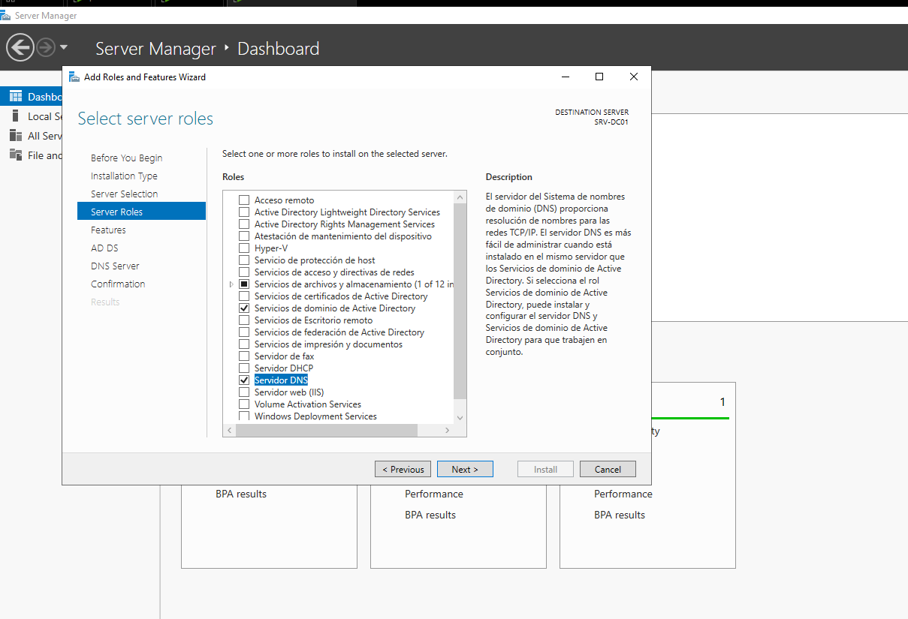

Al marcar los roles, Windows Server agregó automáticamente las características
y herramientas administrativas necesarias.

Entre ellas:

- Herramientas de AD DS.
- Centro de administración de Active Directory.
- Módulo de Active Directory para PowerShell.
- Herramientas del servidor DNS.
- Administración de directivas de grupo.

La instalación de los roles comenzó desde el asistente.

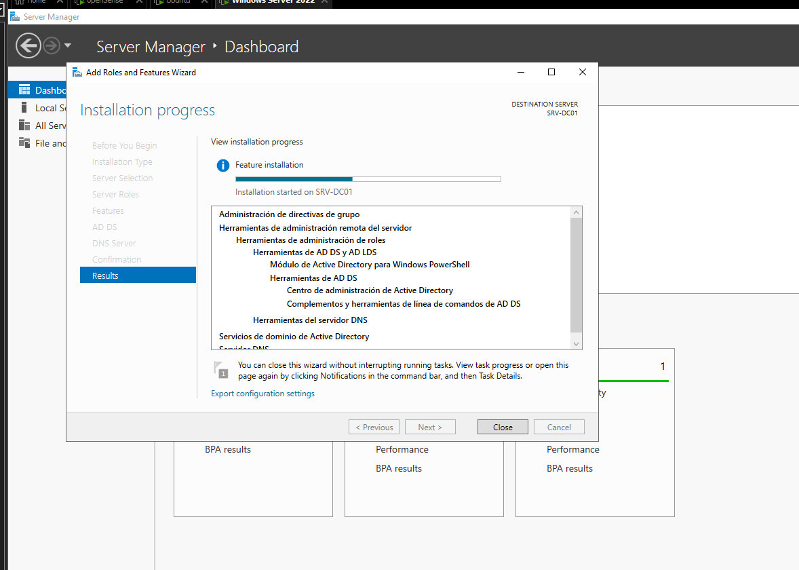

---

# 5. Promoción del servidor a controlador de dominio

Después de instalar los roles, apareció una notificación en el Administrador del
servidor indicando que era necesaria una configuración posterior.

Se seleccionó:

```text
Promover este servidor a controlador de dominio
```

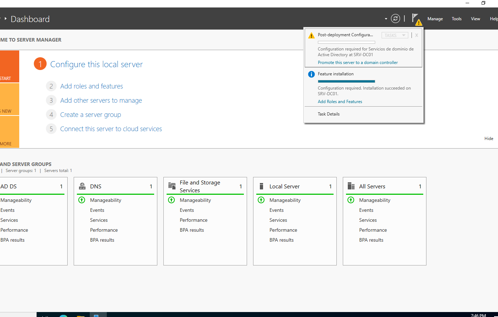

---

# 6. Creación de un nuevo bosque

Como el laboratorio no tenía un dominio previamente creado, se seleccionó:

```text
Agregar un nuevo bosque
```

Se utilizó el siguiente dominio raíz:

```text
soc.lab
```

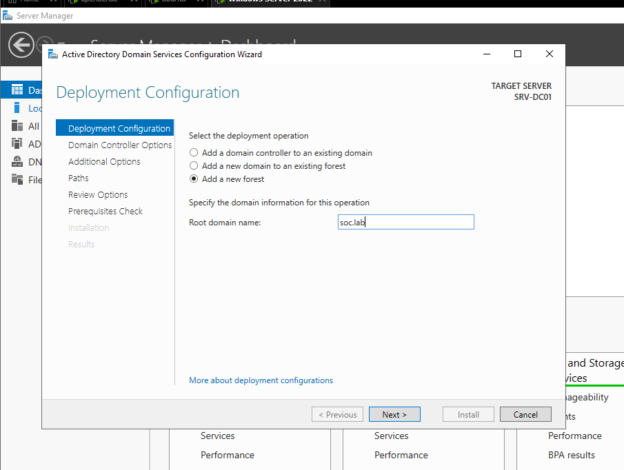

El dominio `soc.lab` se utilizará exclusivamente dentro de la red privada del
laboratorio.

---

# 7. Configuración de las opciones del controlador de dominio

En las opciones del controlador de dominio se mantuvieron los siguientes
niveles funcionales:

```text
Nivel funcional del bosque: Windows Server 2016
Nivel funcional del dominio: Windows Server 2016
```

También se mantuvieron marcadas estas funciones:

```text
Domain Name System Server
Global Catalog
```

La opción:

```text
Read Only Domain Controller
```

se dejó desmarcada.

Además, se creó una contraseña para:

```text
Directory Services Restore Mode
```

La contraseña DSRM se utiliza para recuperar Active Directory en caso de una
falla grave.

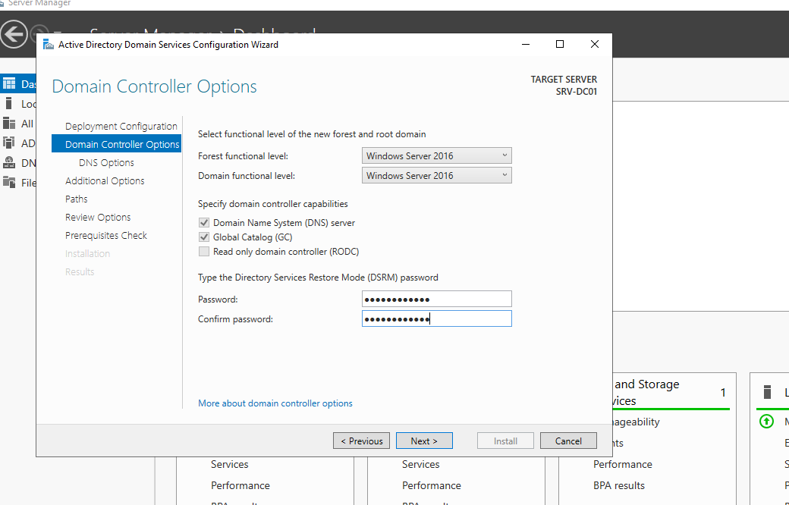

---

# 8. Advertencia de delegación DNS

Durante la configuración apareció una advertencia indicando que no se podía
crear una delegación DNS.

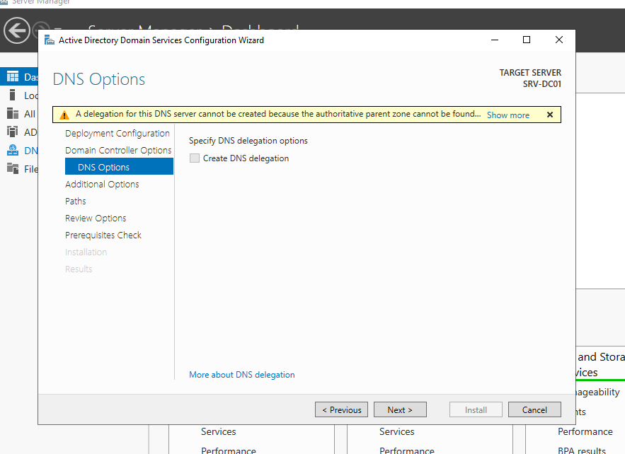

Esta advertencia es normal porque:

- `soc.lab` es un dominio nuevo.
- No existe una zona DNS superior.
- No existe otro servidor DNS padre desde el cual crear la delegación.

No fue necesario realizar ningún cambio.

---

# 9. Configuración del nombre NetBIOS

El asistente generó automáticamente el nombre NetBIOS:

```text
SOC
```

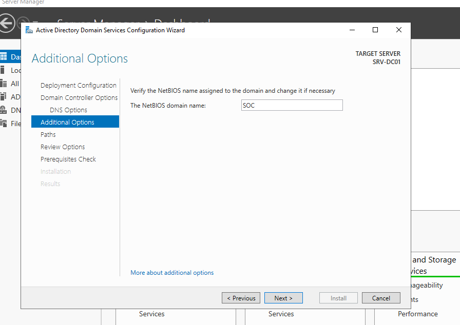

Este nombre permite iniciar sesión utilizando formatos como:

```text
SOC\Administrator
```

o:

```text
SOC\usuario.soc
```

---

# 10. Configuración de las rutas de Active Directory

Se conservaron las rutas predeterminadas:

```text
Base de datos:
C:\Windows\NTDS

Archivos de registro:
C:\Windows\NTDS

SYSVOL:
C:\Windows\SYSVOL
```

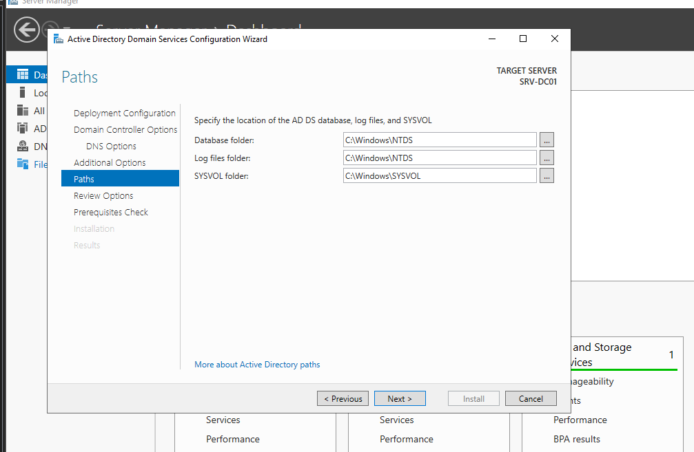

Estas carpetas almacenan:

- La base de datos de Active Directory.
- Los registros del servicio.
- Las políticas de grupo.
- Los scripts del dominio.
- La carpeta SYSVOL.

---

# 11. Revisión de la configuración

Antes de realizar la instalación final, se revisaron las opciones seleccionadas.

La configuración mostraba:

```text
Nuevo bosque: Sí
Dominio: soc.lab
NetBIOS: SOC
DNS Server: Sí
Global Catalog: Sí
DNS Delegation: No
Forest Functional Level: Windows Server 2016
Domain Functional Level: Windows Server 2016
```

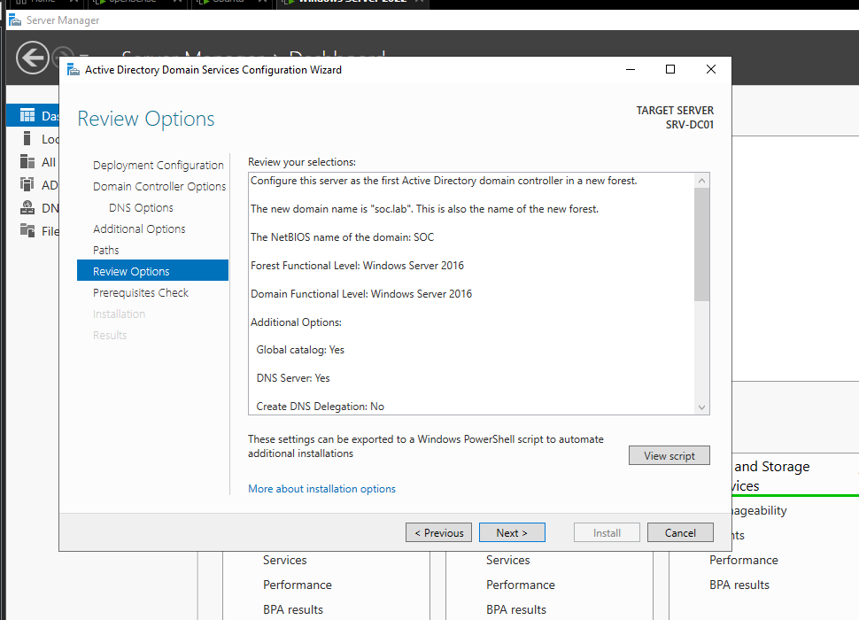

---

# 12. Comprobación de requisitos previos

El asistente realizó una comprobación automática de todos los requisitos.

El resultado principal fue:

```text
All prerequisite checks passed successfully
```

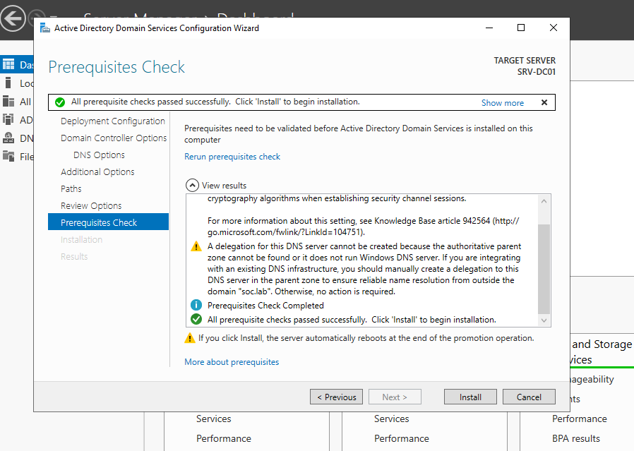

La advertencia relacionada con DNS no impedía la instalación.

Después se seleccionó:

```text
Install
```

El servidor fue promovido y se reinició automáticamente.

---

# 13. Verificación de Active Directory y DNS

Después del reinicio, el Administrador del servidor mostró los roles:

```text
AD DS
DNS
```

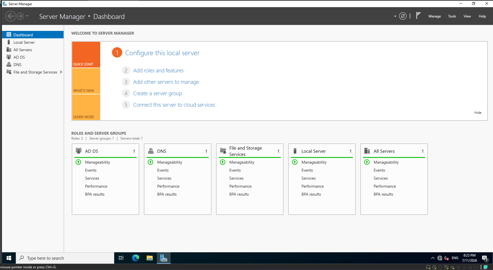

Esto confirmó que la promoción había finalizado correctamente.

---

# 14. Verificación del dominio soc.lab

Desde:

```text
Herramientas
→ Usuarios y equipos de Active Directory
```

se verificó que apareciera:

```text
soc.lab
```

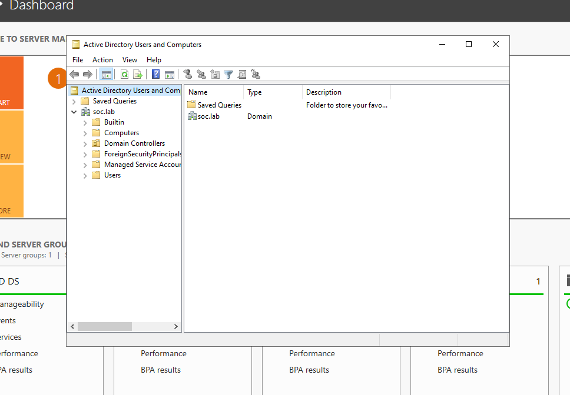

También se mostraron los contenedores predeterminados:

```text
Builtin
Computers
Domain Controllers
ForeignSecurityPrincipals
Managed Service Accounts
Users
```

---

# 15. Verificación del servidor DNS

Desde:

```text
Herramientas
→ DNS
```

se abrió el Administrador de DNS.

Se verificó la presencia del servidor:

```text
SRV-DC01
```

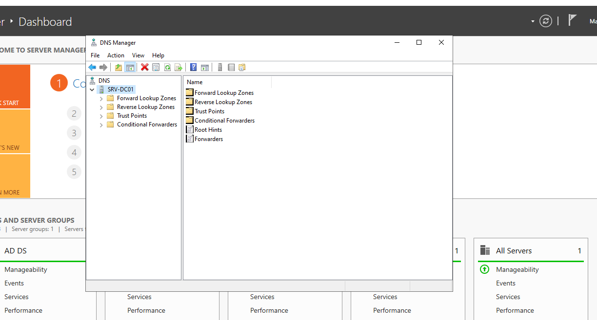

Dentro del servidor se encontraban:

- Forward Lookup Zones.
- Reverse Lookup Zones.
- Trust Points.
- Conditional Forwarders.
- Root Hints.
- Forwarders.

---

# 16. Cambio del DNS preferido

Una vez instalado el rol DNS, el servidor dejó de utilizar OPNsense como DNS
preferido.

La configuración definitiva quedó:

```text
IP: 192.168.126.20
Máscara: 255.255.255.0
Gateway: 192.168.126.254
DNS preferido: 192.168.126.20
DNS alternativo: vacío
```

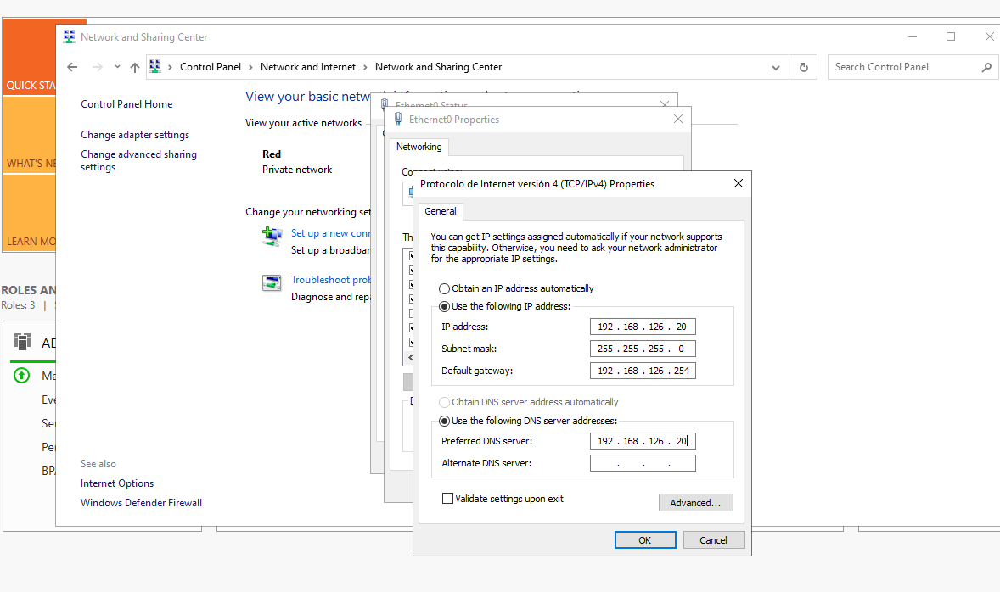

El controlador de dominio debe utilizar su propio DNS para localizar:

- Servicios LDAP.
- Registros SRV.
- Kerberos.
- Controladores de dominio.
- Equipos unidos al dominio.
- Recursos internos.

---

# 17. Verificación de DNS y Active Directory

Se abrió PowerShell como administrador.

Primero se limpió la caché DNS:

```powershell
ipconfig /flushdns
```

Luego se registraron nuevamente los registros DNS:

```powershell
ipconfig /registerdns
```

Se verificó la resolución del dominio:

```powershell
nslookup soc.lab
```

Resultado esperado:

```text
Name: soc.lab
Address: 192.168.126.20
```

También se verificó el nombre completo del servidor:

```powershell
nslookup SRV-DC01.soc.lab
```

Resultado esperado:

```text
Name: SRV-DC01.soc.lab
Address: 192.168.126.20
```

Se comprobó el nombre NetBIOS del dominio:

```powershell
echo $env:USERDOMAIN
```

Resultado:

```text
SOC
```

También se verificó la cuenta actual:

```powershell
whoami
```

Resultado:

```text
soc\administrator
```

Finalmente se ejecutó:

```powershell
dcdiag
```

Las pruebas principales mostraron:

```text
passed test Connectivity
passed test Advertising
passed test FrsEvent
```

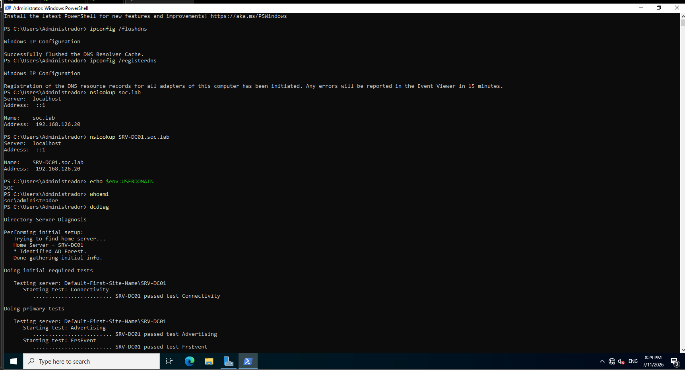

---

# 18. Creación de unidades organizativas

Para organizar los objetos del dominio se crearon las siguientes unidades
organizativas:

```text
Usuarios
Equipos
Servidores
Grupos
```

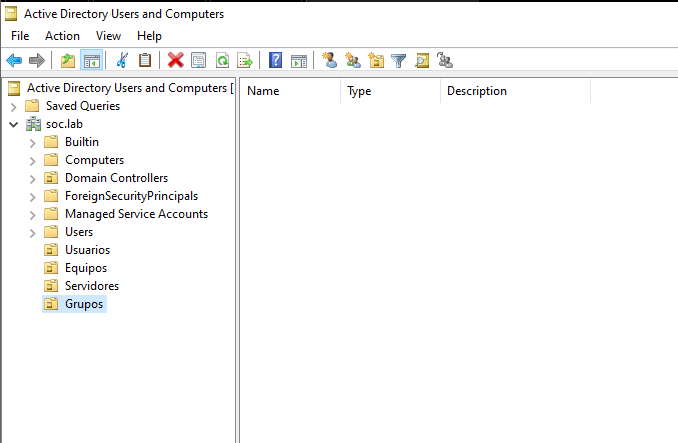

La estructura quedó:

```text
soc.lab
├── Usuarios
├── Equipos
├── Servidores
└── Grupos
```

Cada unidad organizativa permitirá aplicar posteriormente:

- Políticas de grupo.
- Permisos.
- Configuraciones de seguridad.
- Separación lógica de objetos.
- Administración por departamentos o funciones.

El controlador de dominio `SRV-DC01` se mantuvo dentro de:

```text
Domain Controllers
```

No fue movido a la OU `Servidores`, porque los controladores de dominio deben
permanecer en su OU predeterminada.

---

# 19. Creación del usuario del dominio

Dentro de la OU:

```text
Usuarios
```

se creó el usuario:

```text
Nombre: usuario
Apellido: soc
Nombre completo: usuario soc
Nombre de inicio de sesión: usuario.soc
UPN: usuario.soc@soc.lab
```

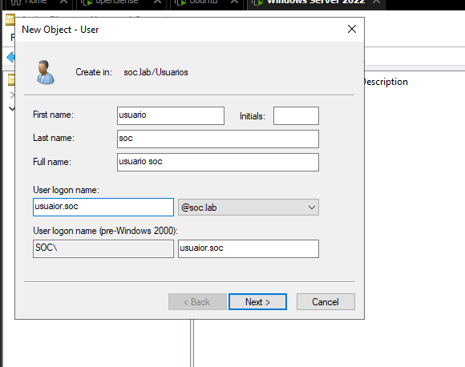

El usuario puede iniciar sesión utilizando:

```text
usuario.soc@soc.lab
```

o:

```text
SOC\usuario.soc
```

---

# 20. Verificación del usuario creado

Después de completar el asistente se verificó que el usuario apareciera dentro
de la OU `Usuarios`.

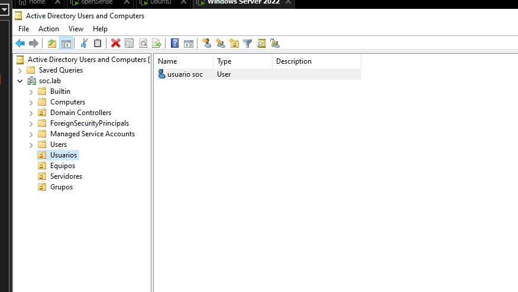

La cuenta quedó disponible para:

- Iniciar sesión en equipos unidos al dominio.
- Ser agregada a grupos de seguridad.
- Recibir políticas de grupo.
- Acceder a recursos internos.
- Generar eventos de autenticación para Wazuh.

---

# 21. Creación del grupo Analistas-SOC

Dentro de la OU:

```text
Grupos
```

se creó el grupo:

```text
Analistas-SOC
```

La configuración utilizada fue:

```text
Group scope: Global
Group type: Security
```

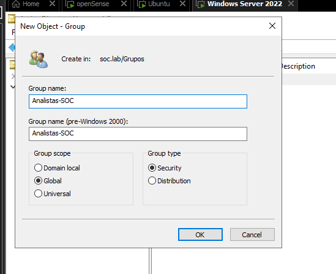

Este grupo será utilizado para:

- Organizar usuarios con funciones SOC.
- Asignar permisos.
- Aplicar políticas.
- Administrar accesos.
- Simular una estructura empresarial.

---

# 22. Búsqueda avanzada del usuario

Al intentar agregar `usuario.soc` al grupo, Active Directory no encontró el
objeto cuando se escribió directamente el nombre de inicio de sesión.

Se abrió la búsqueda avanzada.

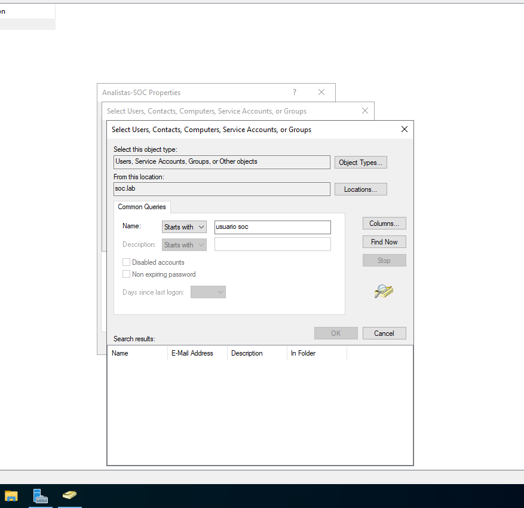

En la búsqueda se utilizó el nombre visible:

```text
usuario soc
```

Esto permitió localizar el objeto correcto.

---

# 23. Selección del usuario para el grupo

Después de localizar el usuario, se seleccionó el objeto:

```text
usuario soc
usuario.soc@soc.lab
```

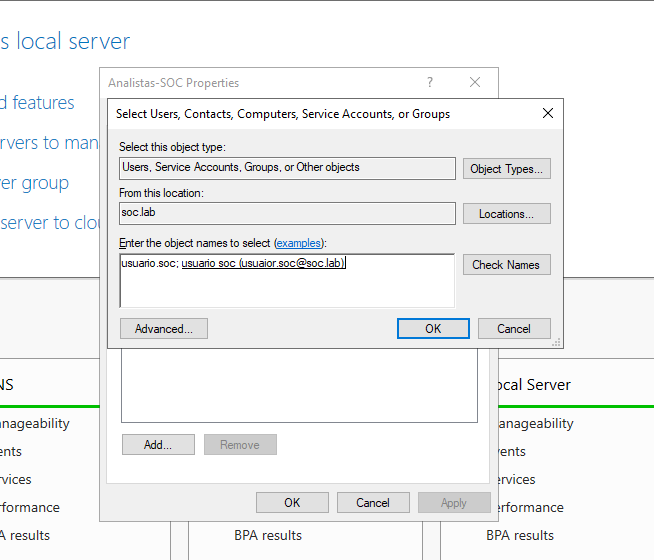

---

# 24. Error de nombre no encontrado

Durante el proceso apareció el mensaje:

```text
Name Not Found
```

El error ocurrió porque Active Directory intentaba validar manualmente:

```text
usuario.soc
```

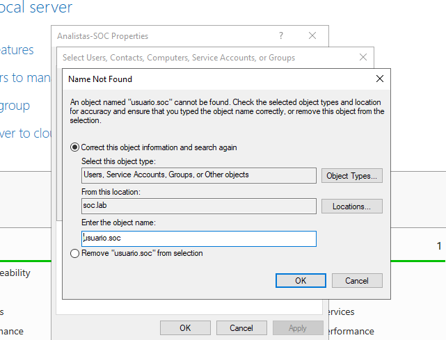

El problema se resolvió eliminando la entrada escrita manualmente y utilizando
el objeto encontrado mediante la búsqueda avanzada.

---

# 25. Verificación de la membresía

Después de corregir el error, se verificó que el usuario apareciera como miembro
de:

```text
Analistas-SOC
```

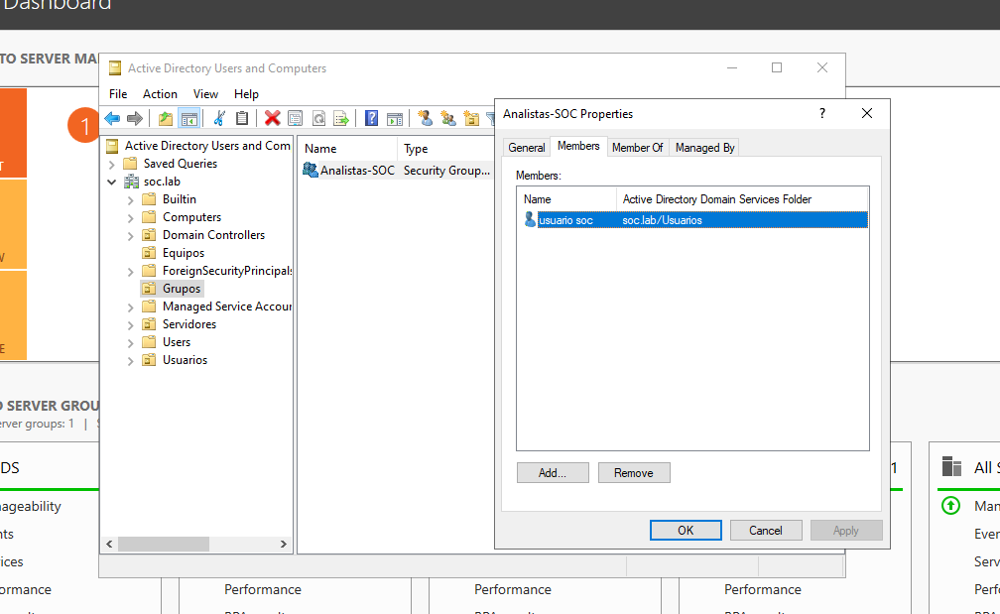

La relación quedó:

```text
Grupo: Analistas-SOC
Miembro: usuario soc
Ubicación: soc.lab/Usuarios
```

---

# 26. Configuración de Kea DHCP en OPNsense

El DHCP de la red LAN es administrado por OPNsense.

La ruta utilizada fue:

```text
Services
→ Kea DHCP
→ Kea DHCPv4
```

Inicialmente no existía ninguna subred configurada.

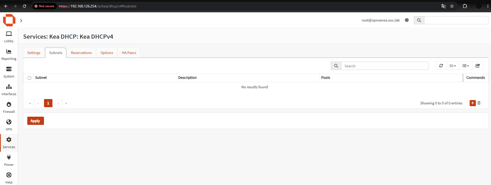

---

# 27. Creación de la subred DHCP

Se agregó una nueva subred con los siguientes valores:

```text
Subnet: 192.168.126.0/24
Description: LAN SOC
Pool: 192.168.126.100-192.168.126.200
```

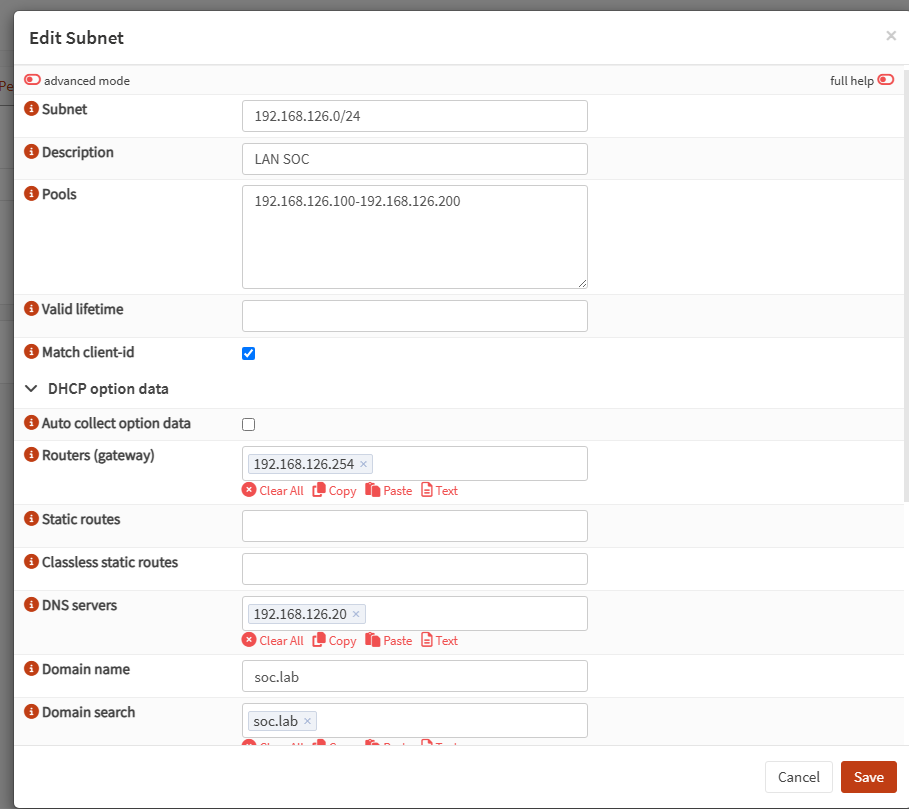

El rango DHCP fue definido para entregar direcciones a:

- Windows 10.
- Kali Linux.
- Equipos adicionales.
- Endpoints temporales.

Las direcciones estáticas del laboratorio se mantienen fuera de este rango.

Ejemplos:

```text
OPNsense: 192.168.126.254
Wazuh: 192.168.126.10
Windows Server: 192.168.126.20
```

---

# 28. Configuración de gateway, DNS y dominio

La opción:

```text
Auto collect option data
```

fue desactivada.

Esto permitió definir manualmente los valores que recibirán los clientes.

Se configuró:

```text
Routers gateway: 192.168.126.254
DNS servers: 192.168.126.20
Domain name: soc.lab
Domain search: soc.lab
```

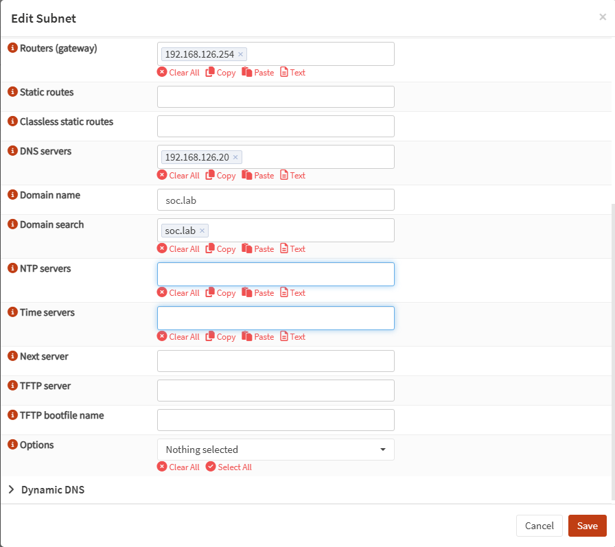

Los demás campos quedaron vacíos:

```text
Static routes
Classless static routes
NTP servers
Time servers
Next server
TFTP server
TFTP bootfile name
```

Esto garantiza que los clientes del dominio utilicen como DNS al controlador de
dominio.

---

# 29. Verificación de la subred creada

Después de guardar la configuración se verificó que apareciera:

```text
Subnet: 192.168.126.0/24
Description: LAN SOC
Pools: 192.168.126.100-192.168.126.200
```

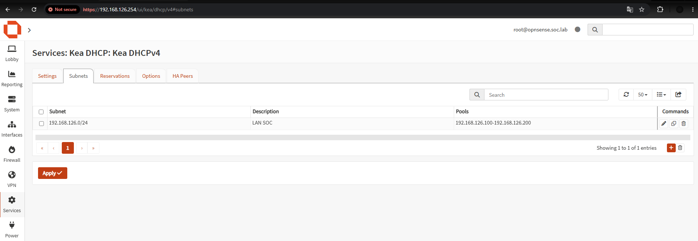

---

# 30. Activación de Kea DHCPv4

Desde la pestaña `Settings` se verificó:

```text
Enabled: activado
Interfaces: LAN
Valid lifetime: 4000
Firewall rules: activado
Socket Type: raw
```

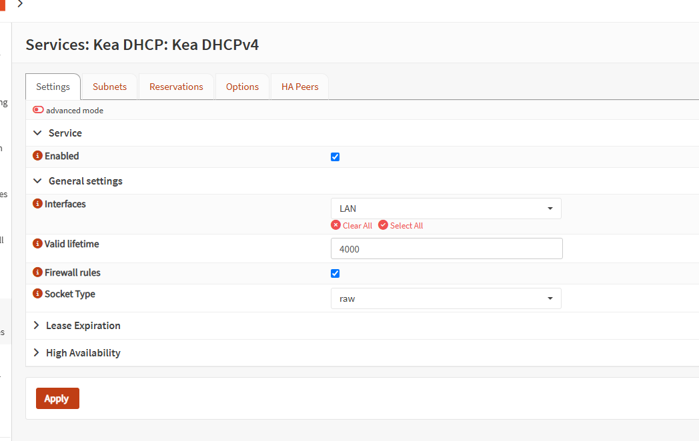

Finalmente se aplicaron los cambios.

---

# Configuración que recibirán los clientes

Los clientes conectados a `VMnet2` recibirán:

```text
Dirección IP: 192.168.126.100-192.168.126.200
Máscara: 255.255.255.0
Gateway: 192.168.126.254
DNS: 192.168.126.20
Dominio: soc.lab
```

Esta configuración permitirá que Windows 10 pueda localizar:

```text
soc.lab
```

y unirse correctamente al dominio.

---

# Resultado final

Windows Server 2022 quedó configurado correctamente como controlador de dominio
principal del laboratorio SOC.

La configuración final permite:

- Administrar el dominio `soc.lab`.
- Autenticar usuarios y equipos.
- Resolver nombres internos mediante DNS.
- Crear usuarios del dominio.
- Crear grupos de seguridad.
- Organizar objetos mediante unidades organizativas.
- Aplicar políticas de grupo posteriormente.
- Integrar Windows 10 al dominio.
- Proporcionar DNS interno mediante DHCP.
- Mantener comunicación con OPNsense.
- Mantener comunicación con Wazuh.
- Mantener salida a Internet.
- Generar eventos de seguridad para su monitoreo en Wazuh.

La configuración final es:

```text
Servidor: SRV-DC01
Dominio: soc.lab
NetBIOS: SOC
IP: 192.168.126.20
Gateway: 192.168.126.254
DNS: 192.168.126.20
Roles: AD DS y DNS
Usuario: usuario.soc
Grupo: Analistas-SOC
DHCP: Kea DHCPv4 en OPNsense
```

El servidor quedó preparado para continuar con:

1. Creación de la máquina Windows 10.
2. Conexión de Windows 10 a `VMnet2`.
3. Verificación de la dirección entregada por DHCP.
4. Cambio del nombre del equipo cliente.
5. Unión de Windows 10 al dominio `soc.lab`.
6. Inicio de sesión con `usuario.soc`.
7. Instalación del agente de Wazuh.
8. Creación de políticas de grupo.
9. Monitoreo de eventos de autenticación y seguridad.
